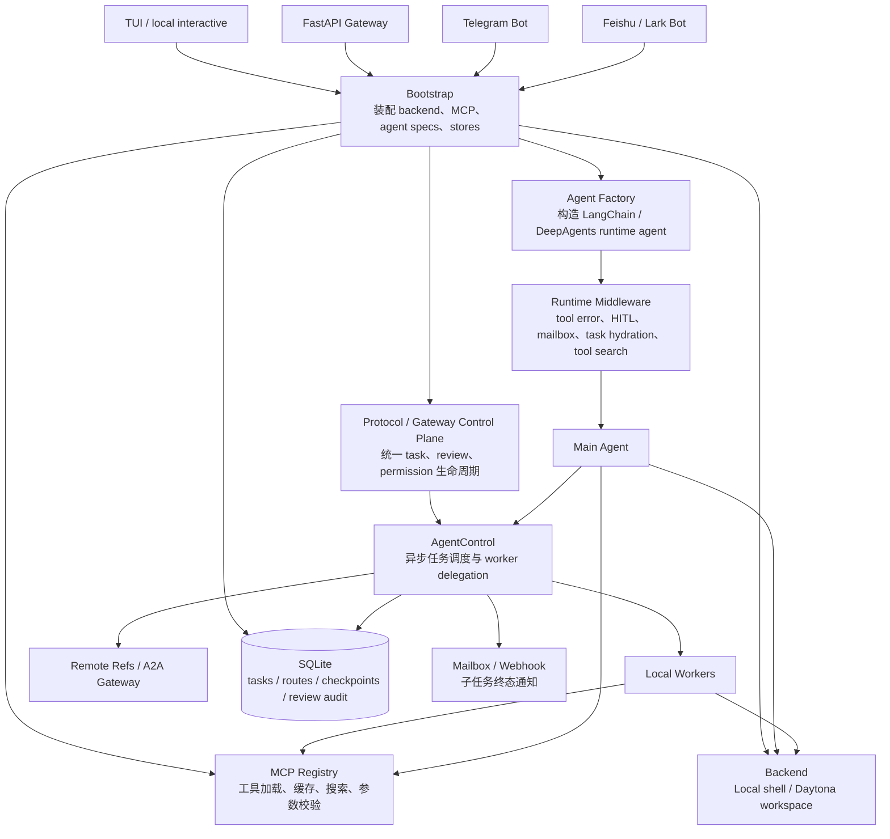

# Ruyi Agent

`ruyi-agent` 是一个面向工程化场景的 Agent Runtime。它不是单轮 chatbot demo，而是围绕多入口接入、多 Agent 委派、MCP 工具治理、任务持久化、HITL 审批、权限策略和审计日志，搭建一套可扩展、可控制、可恢复的 Agent 执行平台。

项目仍处在实验和快速演进阶段，适合研究、二次开发和小规模自托管验证。生产环境使用前请重点检查权限策略、Gateway 暴露方式、backend 隔离和密钥管理。

## Demos


- [PPT generation demo](https://github.com/ccpowe/ruyi-agent/releases/download/%E6%BC%94%E7%A4%BA/ruyi_ppt.mp4)：通过 agent workflow 生成演示 PPT。
- [Snake web app demo](https://github.com/ccpowe/ruyi-agent/releases/download/%E6%BC%94%E7%A4%BA/ruyi_snake.mp4)：通过 agent workflow 生成并运行 Web 贪吃蛇应用。

## 核心能力

- 多入口接入：以 FastAPI Gateway、Telegram Bot、Feishu/Lark Bot 为主要入口，同时保留 TUI 用于本地调试。
- 多 Agent 委派：支持本地 worker 和远端 `remote_ref`，统一通过 task 控制面调度。
- MCP 工具治理：支持多 MCP server 加载、工具缓存、重名冲突处理、schema 参数校验、工具搜索和按 agent scope 注入。
- skills:支持给agent配置skills 拓展agent的能力边界
- 异步任务运行时：支持 `spawn_agent`、`wait_agent`、`send_input`、`cancel_agent`、任务状态查询和终态通知。
- 任务持久化：基于 SQLite 保存 task、route、checkpoint、review audit 等运行状态。
- HITL 审批：把 root agent 和 worker/subagent 的审批请求统一投影为 review 资源。
- 权限策略：基于 `permissions.toml` 声明工具白名单、shell 命令前缀规则、审批策略和拒绝策略。
- Gateway 控制面：提供 agents、tasks、reviews、artifact download 等 HTTP API。
- 委派安全边界：通过 delegation context 记录 `root_id`、`depth`、`visited_nodes`，防止环路和深度超限。
- 执行环境隔离：支持 `local` 和 `daytona` backend，可通过 Daytona sandbox 隔离物理机与 Agent shell 执行环境。

## 架构图



## 核心链路

### Channel / Gateway 接入链路

```text
用户从 Feishu / Telegram / HTTP API 发起请求
  -> channel adapter 或 Gateway HTTP route 校验 token、agent 和输入
  -> bootstrap_application 装配 runtime
  -> GatewayService / AgentControl 创建 task
  -> runtime agent 执行，并可继续委派 worker / remote_ref
  -> TaskStore / ReviewAuditStore 持久化任务状态和审批事件
  -> channel adapter 轮询 task/review，并把终态或审批请求返回给用户
```

### Gateway 创建任务链路

```text
POST /agents/{agent_name}/tasks
  -> Bearer token 认证
  -> 校验 public agent / remote_ref
  -> 写入附件到 backend workspace
  -> AgentControl 创建 TaskRecord
  -> 本地 worker 异步执行，或通过 A2A 转发到远端 gateway
  -> TaskStore / GatewayRouteStore 持久化状态
  -> GET /tasks/{task_id} 查询任务结果
```

### Subagent 委派链路

```text
主 agent 调用 spawn_agent
  -> 校验当前 agent 的 workers scope
  -> 构造 DelegationContext
  -> 检查 depth、visited_nodes、max_tasks_per_root
  -> 创建本地 worker task 或 remote_ref proxy task
  -> 子任务终态写入 TaskStore
  -> mailbox / webhook 通知父 agent
```

## 快速运行

### 1. 安装

```bash
# 从源码开发
uv sync

# 作为 uv tool 使用
uv tool install ruyi-agent
```

安装后命令是 `ruyi`。源码开发时可以用 `uv run ruyi` 或 `uv run python main.py`。

`uv tool install` 只安装命令，不会执行初始化。首次使用前需要显式创建配置目录：

```bash
ruyi --init
```

如果之前用旧 wheel 生成过空白或损坏的 starter config，可以用 `ruyi --init --force` 用当前包内模板覆盖这些生成文件。真实密钥和自定义 agent 配置会被覆盖，执行前先确认不需要保留。

### 2. 配置运行目录

Ruyi 统一从 `.ruyi_agent` 读取运行配置。源码仓库默认使用当前项目下的 `.ruyi_agent/`；uv tool 安装后通常使用用户目录下的 `~/.ruyi_agent/`。

至少需要在 `.ruyi_agent/ruyi.toml` 设置：

- `model_credentials.openrouter_api_key`：默认 provider 可用 OpenRouter；仓库当前默认也可改用 OpenAI Codex OAuth provider。
- `channels.telegram.bot_token`：仅 Telegram 模式需要。
- `channels.feishu.app_id` / `channels.feishu.app_secret`：仅 Feishu/Lark 模式需要。

其他运行参数已经给出本地开发默认值。`GATEWAY_BEARER_TOKEN` 默认是 `dev-token`，只适合绑定 `127.0.0.1` 的本地调试；对外暴露 Gateway 前必须改成强随机 token。

`.ruyi_agent/ruyi.toml` 是 TOML 文件，URL 和 Windows 路径都要写成字符串，例如 `api_url = "https://example.com/api"`、`workspace = "C:/Users/name/project"`。

### 3. 检查配置文件

默认配置位于：

- `.ruyi_agent/ruyi.toml`：运行参数、凭据、Gateway/Telegram/Feishu/backend/storage 设置。
- `.ruyi_agent/config/agents.toml`：agent、worker、remote_ref、模型和权限 profile。
- `.ruyi_agent/config/agents.toml.example`：脱敏 starter config，可复制为 `.ruyi_agent/config/agents.toml` 后再调整。
- `.ruyi_agent/config/mcp_servers.toml`：MCP server 声明。
- `.ruyi_agent/config/llm_providers.toml`：模型 provider 声明。
- `.ruyi_agent/config/permissions.toml`：工具和 shell 命令权限策略。

仓库默认携带的是安全 starter config；接入真实服务前，请按自己的 agent、模型 provider、MCP server 和权限策略调整配置。

详细说明见 [配置指南](docs/configuration.zh-CN.md)，其中包含 `ruyi.toml`、`agents.toml`、模型供应商、MCP server 和权限 profile 的示例。

### Skills

Ruyi 会从固定目录扫描 skills，并在创建任务时按 agent 配置同步成 backend 内部 skill view。支持的扫描目录按优先级从高到低为：

```text
workspace/.agents/skills
~/.agents/skills
~/.ruyi_agent/skills
```

`.ruyi_agent/config/agents.toml` 中的 `skills` 字段现在表示可见性，不再表示目录：

```toml
skills = ["repo-workflow", "frontend"]  # 只允许这些 skill name
skills = "inherit"                      # 继承父任务 effective skills；根任务使用扫描到的 skills
skills = "none"                         # 禁用 skills
```

### 4. Gateway 模式

```bash
ruyi --gateway
```

默认监听：

```text
http://127.0.0.1:8000
```

Gateway 是推荐的控制面入口，负责公开 agent 列表、创建任务、查询任务状态、处理 HITL review，并为 Telegram / Feishu adapter 提供后端 HTTP API。

### 5. Telegram 模式

```bash
ruyi --telegram
```

需要设置 `.ruyi_agent/ruyi.toml` 里的 `channels.telegram.bot_token`。该模式会在同一进程里启动 Gateway 和 Telegram adapter。

### 6. Feishu/Lark 模式

```bash
ruyi --feishu
```

需要设置 `.ruyi_agent/ruyi.toml` 里的 `channels.feishu.app_id` 和 `channels.feishu.app_secret`。该模式会在同一进程里启动 Gateway 和 Feishu adapter。Feishu 当前使用 WebSocket 长连接；默认是私聊模式，群聊场景需要设置 `channels.feishu.group_policy = "open"`，并保留 mention 要求与 bot identity 或访问白名单。

同时启动所有已配置的非 TUI channel：

```bash
ruyi --all
```

### 7. TUI 模式

```bash
ruyi
ruyi --tui
```

TUI 主要用于本地开发和调试。默认 workspace 是当前目录，也可以显式指定：

```bash
ruyi --workspace /path/to/workspace
```

## 模型 Provider

OpenRouter、DeepSeek、Kimi/Moonshot 和 LiteLLM/Z.AI 通过 `.ruyi_agent/config/llm_providers.toml` 配置，agent 在 `.ruyi_agent/config/agents.toml` 中通过 `provider` 字段引用。

常见切换示例：

```toml
provider = "deepseek"
model = "deepseek-v4-pro"

provider = "zai"
model = "zai/glm-5.1"
```

OpenAI Codex OAuth provider 也可以用于本机实验。先完成一次 device login：

```bash
UV_CACHE_DIR=/tmp/uv-cache uv run python scripts/probe_openai_codex.py \
  --device-login \
  --save-auth-json \
  --list-models \
  --live-response
```

认证会保存到 `~/.ruyi_agent/openai_codex_auth.json`。之后可在 `.ruyi_agent/config/agents.toml` 中配置：

```toml
model = "gpt-5.3-codex"
provider = "openai_codex"
```

## API 示例

列出可公开访问的 agent：

```bash
curl -H "Authorization: Bearer $GATEWAY_BEARER_TOKEN" \
  http://127.0.0.1:8000/agents
```

创建任务：

```bash
curl -X POST \
  -H "Authorization: Bearer $GATEWAY_BEARER_TOKEN" \
  -H "Content-Type: application/json" \
  http://127.0.0.1:8000/agents/main/tasks \
  -d '{
    "input": {
      "content": "分析这个项目的 Agent Runtime 架构，并总结核心模块。"
    },
    "metadata": {
      "source": "readme-example"
    }
  }'
```

查询任务：

```bash
curl -H "Authorization: Bearer $GATEWAY_BEARER_TOKEN" \
  http://127.0.0.1:8000/tasks/{task_id}
```

查询待审批 review：

```bash
curl -H "Authorization: Bearer $GATEWAY_BEARER_TOKEN" \
  http://127.0.0.1:8000/reviews
```

提交审批决策：

```bash
curl -X POST \
  -H "Authorization: Bearer $GATEWAY_BEARER_TOKEN" \
  -H "Content-Type: application/json" \
  http://127.0.0.1:8000/reviews/{review_id}/decision \
  -d '{
    "decisions": [
      { "type": "approve" }
    ]
  }'
```

## 测试

```bash
uv run pytest
```

测试覆盖的重点模块包括：

- Async subagent runtime
- Gateway HTTP API
- MCP Registry
- Permission Policy
- HITL middleware
- Review audit
- Telegram adapter
- Feishu/Lark adapter
- Tool error middleware
- Tool search middleware
- Config loader

## 安全提示

- 不要提交真实凭据、SQLite 数据库、日志、运行工作区、OAuth token 或 bot token。
- `BACKEND_KIND=local` 会在本机执行 shell 命令，不提供 Daytona 级别的进程隔离。
- 对公网暴露 Gateway 前，必须把默认 `dev-token` 改成强 `GATEWAY_BEARER_TOKEN`，并建议放在反向代理、TLS 和网络访问控制之后。
- 开源发布前请脱敏 `.ruyi_agent/ruyi.toml` 和 `.ruyi_agent/config/agents.toml`，尤其是凭据、远端 URL、私有人设、内部 worker 名称和默认权限 profile。

## todo
- [ ] agent跨线程记忆,接入TencentDB-Agent-Memory （即将完成）
- [ ] skills 同步机制,自动同步不同wokespace下的skills (正在执行)
- [ ] 增加示例agent_team,增加开箱使用体验
- [ ] 更清晰的部署教程（正在执行）
- [ ] 探索AI 小组/会议 形式的agent协作形式
- [ ] 增加和优化channle体验(已经支持飞书/telegram)
## License

MIT License. See [LICENSE](LICENSE).

## 关键代码

```text
src/ruyi_agent/entrypoints/main.py              # TUI / Gateway / Telegram / Feishu 入口
src/ruyi_agent/runtime/bootstrap.py             # 运行时装配
src/ruyi_agent/runtime/agent_factory.py         # Agent 构造
src/ruyi_agent/runtime/delegation/async_runtime.py
src/ruyi_agent/integrations/mcp/registry.py
src/ruyi_agent/channels/http/api.py
src/ruyi_agent/channels/gateway_client.py
src/ruyi_agent/channels/feishu/adapter.py
src/ruyi_agent/channels/telegram/adapter.py
src/ruyi_agent/control_plane/controller.py
src/ruyi_agent/control_plane/reviews.py
src/ruyi_agent/control_plane/permissions.py
src/ruyi_agent/storage/task_store.py
src/ruyi_agent/storage/gateway_route_store.py
src/ruyi_agent/storage/review_audit.py
```
