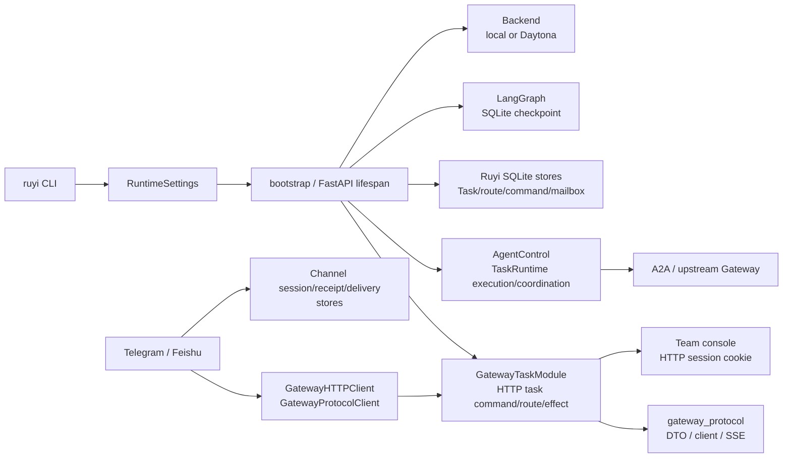

# Ruyi Agent 架构

## 1. 范围与事实权威

本文是 Ruyi Agent 当前态的架构总览：它说明一个 `ruyi` 进程如何装配
Gateway、runtime、持久化、channel 和外部集成，以及这些边界之间如何传递任务、
事件和效果。它不描述已删除的实现、历史决策或未来计划，也不替代各模块的稳定
协议文档。

事实优先级是当前代码、行为测试和 CI；[根规则](../AGENTS.md) 记录了当前有效的
边界、安全约束和证据入口，[README](../README.md) 提供用户可见的启动语境。本文中
“Gateway”特指外部任务控制面，“runtime”特指执行与协调面；两者在同一进程中
协作，但不是同一个 ownership。

关键事实入口包括 [CLI](../src/ruyi_agent/entrypoints/main.py)、
[bootstrap](../src/ruyi_agent/runtime/bootstrap.py)、
[Gateway application](../src/ruyi_agent/gateway/application.py)、
[TaskRouter](../src/ruyi_agent/gateway/routing.py)、
[gateway protocol DTO](../src/ruyi_agent/gateway_protocol/dto.py)、
[AgentControl](../src/ruyi_agent/runtime/delegation/async_runtime.py) 和
[HTTP route composition](../src/ruyi_agent/channels/http/routes.py)。

## 2. 系统总览



`bootstrap` 是进程的 composition 和 lifecycle root。它创建共享的 backend、MCP
registry、LangGraph checkpointer、SQLite stores、`AgentControl` 和 Gateway
service；FastAPI lifespan 结束时按相反方向释放它们。Gateway 与 channel adapter
在同一进程的 TaskGroup 中运行，但 adapter 通过 `settings.gateway.base_url` 配置的
Gateway HTTP endpoint 访问 Gateway 的公开面；starter/default 为 loopback，同进程
TaskGroup 不强制 endpoint 必须 loopback。adapter 不接收 `AppRuntime` 或 Gateway
service。

## 3. 入口与进程拓扑

1. [入口实现](../src/ruyi_agent/entrypoints/main.py) 解析 `--gateway`、
   `--telegram`、`--feishu`、`--all`、`--workspace` 和初始化选项，然后调用
   `configure_runtime_environment`。runtime TOML 与受支持的有限 env alias 在配置
   边界被解析成不可变 `RuntimeSettings`；启动后的消费者不再自行读取同一批原始
   配置。
2. `create_app` 将 settings 交给
   [`create_bootstrapped_gateway_app`](../src/ruyi_agent/runtime/bootstrap.py)。
   该 app 只在 FastAPI lifespan 内持有异步 runtime；lifespan 打开
   `bootstrap_application`，把 `AppRuntime.gateway_service` 暴露给 HTTP 路由，
   退出前先停止接受新请求，再关闭 worker、stores、checkpointer 和 backend。
3. `--gateway` 启动 Gateway-only 进程。`--telegram`、`--feishu` 和 `--all` 都
   把 Gateway 与所选 Telegram/Feishu adapter 放入同一个 `asyncio.TaskGroup`；
   `--all` 只保留已配置凭据的 adapter。adapter 通过
   `settings.gateway.base_url` 配置的 Gateway HTTP endpoint 访问 Gateway/runtime
   的公开 HTTP surface；starter/default 为 loopback，但同进程 TaskGroup 不强制
   endpoint 必须 loopback。adapter 不被注入 `AppRuntime` 或 Gateway service；各
   adapter 自己拥有
   channel-specific session、receipt 和 delivery stores，也不访问 Gateway/runtime
   的 Task、route、command stores 或 LangGraph。
4. [`channels/http/routes.py`](../src/ruyi_agent/channels/http/routes.py) 是 HTTP
   组合面：它挂载 probes、task、event、review、artifact 和 team-console 路由。
   路由只从 request context 取得当前 Gateway service；业务认证、错误投影和传输
   细节留在 HTTP 边界，不让 adapter 直接进入 runtime 内部。

## 4. 子系统边界表

| 子系统 | 拥有的当前行为 | 明确不拥有的行为 |
| --- | --- | --- |
| config / bootstrap（[运行时配置与 Bootstrap](systems/runtime-configuration-and-bootstrap.md)） | 发现路径、解析 runtime TOML、产出 `RuntimeSettings`；分别加载 Agent、Provider、permission；保留 MCP raw connection dict；装配并管理进程级资源生命周期 | 不把 bootstrap 里的全部对象伪装成 config ownership；不让下游重复解析原始配置 |
| Gateway（[Gateway Task 控制面](systems/gateway-task-control-plane.md)） | 公开 Agent/Task/Review/Artifact 操作；创建 command、预留 route、选择 local/remote route、编排 effect、恢复和对外错误 | 不执行 Agent turn；不直接重建 channel 的 session 或 delivery 语义 |
| gateway_protocol（[Gateway HTTP 与 gateway_protocol](systems/gateway-http-protocol.md)） | wire DTO、HTTP client/transport、opaque cursor、SSE 编解码/校验、Task event public projection | 不拥有稳定 API response projection；`Agent/Task/Review/Artifact` response 由 `gateway/application.py::GatewayProjection` 拥有 |
| runtime / delegation / middleware / skills（[Task execution runtime](systems/task-execution.md)、[Runtime 委派系统](systems/task-delegation.md)、[Agent graph 与 tool runtime](systems/agent-tool-runtime.md)、[Task Mailbox 与 child settlement](systems/task-mailbox-settlement.md)、[Skills 系统](systems/skills.md)） | `AgentControl` 与 `TaskRuntime`；local execution、remote delegation/reconciliation、mailbox、supervisor、policy；task hydration、tool/approval/artifact/skills middleware；skill catalog、解析和 view 同步 | 不成为外部 HTTP command 的认证/路由入口；不把 wire DTO 当作执行状态 |
| storage / checkpoint | Ruyi SQLite schema、stores、repositories、Unit of Work；runtime 的 Task、Gateway 的 route/command 和 runtime settled outbox 等 durable 记录；LangGraph checkpoint 的存储配合；channel-specific store 实现 | checkpoint lifecycle 由 bootstrap 管理；业务 projection 语义在 runtime/Gateway；storage 不拥有 public response 或 channel 文案 |
| channels（[Channel 系统](systems/channels.md)） | platform turn、identity、session、receipt、presentation、delivery，以及 Telegram/Feishu 外部 API 适配；channel-specific session/receipt/delivery store 的语义与生命周期；HTTP transport routes | 只通过 `GatewayHTTPClient`/`GatewayProtocolClient` 访问 Gateway，不直接读写 Gateway/runtime 的 Task、route、command stores 或调用内部 Agent executor |
| integrations（[Model Provider 与 MCP 工具集成](systems/model-and-tool-integrations.md)、[Execution backend 与 workspace 边界](systems/execution-backends-and-workspace.md)） | Provider 工厂与命名环境变量、OpenAI Codex、A2A remote-ref/client、MCP registry、local/Daytona backend runtime | 不替代 Gateway route ownership；凭据不应主动投影到 wire DTO 或 Task projection；日志没有统一 redaction 保证，MCP/tool/provider 底层异常不得含凭据 |
| team console | 随包分发的静态 UI 资源；以浏览器 session cookie 访问 debug console | 静态资源不拥有服务路由或任务业务；服务路由和 session auth 仍由 `channels/http` 管理 |

实现入口分别见 [backend runtime](../src/ruyi_agent/integrations/backend/runtime.py)、
[A2A client](../src/ruyi_agent/integrations/a2a/client.py)、
[channel turn](../src/ruyi_agent/channels/turn.py)、
[channel Gateway client](../src/ruyi_agent/channels/gateway_client.py) 和
[team-console assets](../src/ruyi_agent/web/team_console/index.html)。

## 5. 依赖方向

依赖可以压缩为以下单向骨架：

```text
CLI -> RuntimeSettings -> bootstrap/lifespan
                                  |
                   +--------------+----------------+
                   v              v                v
                Gateway       AgentControl      stores/checkpoint/backend
                   |              |
       GatewayProjection/Router  TaskRuntime -> delegation/middleware/skills
                   |              |                |
              protocol DTO       +-----------> integrations
```

- 入口只依赖 typed settings 和 bootstrap；它不复制 Agent、Provider、route 或
  checkpoint 的 ownership。
- Gateway 通过 `AgentControl`/runtime facade 读取任务、创建/输入/取消任务、打开
  event stream、处理 review 和 remote reconciliation。Gateway 的
  `GatewayProjection` 负责稳定 HTTP response；`TaskRouter` 负责 local/remote
  route 选择与公共错误翻译。
- `gateway_protocol` 提供可复用的 wire 约束。Gateway HTTP route、channel client
  和 A2A client 共享它们，但共享协议不意味着共享业务状态所有权。
- Telegram/Feishu channel 只通过
  [`GatewayHTTPClient`](../src/ruyi_agent/channels/gateway_client.py) 和
  `GatewayProtocolClient` 走 Gateway HTTP；channel 不绕过 Gateway 直接调用
  `AgentControl`、Gateway/runtime 的 SQLite repository 或 LangGraph；它们自己的
  session/receipt/delivery durable state 仍由 channel 边界管理。
- runtime 依赖 storage/checkpoint/backend/integrations 的接口和对象；storage
  可以被 runtime/Gateway 调用以持久化，但不回调 public projection，也不拥有
  任务的业务展示语义。

## 6. 三条主流程

### 6.1 本地 Task

1. HTTP task route 先通过业务 bearer 校验，再把请求交给 Gateway command service。
   service 校验 public/available Agent，解析输入和附件，并把带
   `Idempotency-Key` 的 create/input 交给 `GatewayCommandStore`。
2. `TaskRouter` 选择并建立 local route。TaskStore 内部只把 Task row 与首个
   lifecycle event 在同一个 TaskStore Unit of Work 内原子提交；
   `GatewayRouteStore` 则维护独立的 route ledger/数据库，route reservation 与
   activation 不和这个 UoW 合并，而由 effect boundary、route 状态机和
   reconciliation 协调。成功返回的 `task_id` 是 Gateway 的公开任务身份。
3. Gateway 调用 `AgentControl.spawn_task`，runtime 的 local executor 使用配置的
   Agent、middleware、backend 和 LangGraph checkpointer 执行一轮。review、完成、
   失败、中断和取消都回到 runtime 的 Task state/ledger。
4. [`TaskEventLedger`](../src/ruyi_agent/runtime/task_event_ledger.py) 将 durable
   lifecycle event 写入 TaskStore，并向当前订阅者做进程内 fan-out；HTTP SSE 由
   Gateway protocol 编码。channel 或其他 client 可以随后用 Task response、消息
   projection 或 SSE 观察同一个 Task。

### 6.2 remote route / delegation

远端执行有两条 ownership 不同的路径；它们都可以调用 A2A 和 gateway protocol，
但不能把两种状态混为一谈。

**公开 Gateway remote create**

1. 公开 Gateway 的 remote create 由 `TaskRouter`/`CreateRouteWorkflow` 处理，先经
   `GatewayRouteStore` 预留本地 public `task_id` 的 remote route，再由 runtime
   remote port 调用 [`A2AClient`](../src/ruyi_agent/integrations/a2a/client.py)。
   route ledger 维护 reservation、activation、reconciliation 以及 public task id
   到 upstream task id 的绑定。
2. upstream id 只用于与上游交互，不能取代 public id；对外 Task、event、message
   和错误都以 Gateway public id 作为边界。查询、输入、取消、webhook 或事件到达
   时，Gateway 按 route 查找并按需要 reconcile；上游响应和 SSE 必须校验 task、
   run、event 形状，fresh stream 先有 snapshot，resume stream 不凭空插入 snapshot。

**runtime 内部 worker delegation**

3. runtime 内部 worker delegation 由 `TaskRuntime` + `RemoteTaskPort` 创建和维护
   本地 proxy Task，直接调用 A2A；它不经过 `TaskRouter`，也不会凭空建立 Gateway
   route。该路径的 ownership 是 runtime 的 delegation、Task state、mailbox 和
   reconciliation，而不是公开 Gateway route ledger。
4. 两条路径都要区分请求尚未发出与可能已发出的 effect boundary；possibly
   dispatched 不应被普通网络重试当作安全重放。公开 route 的 route/command 状态和
   内部 delegation 的 proxy Task/reconciliation 各自保留可查询身份与不确定性。
5. 对公开 Gateway remote route 的 message page，先验证返回的 `task_id` 等于 route
   保存的 upstream id，再**只重写顶层 `task_id`** 为 public id，并保留 `items` 和
   opaque `cursor`。这只保证该 identity 校验和顶层改写；这些保留字段不在“不含
   upstream identity”的保证范围内。

### 6.3 channel inbound / track / delivery

1. Telegram/Feishu adapter 把平台事件规范化为
   [`InboundTurn`](../src/ruyi_agent/channels/turn.py)。DM session key 是
   `platform + agent + chat`；群聊再加入 user，有 thread/topic 时再加入该维度。
   identity 和 thread 信息留在 channel 边界。
2. `ChannelTurnHandler` 通过 Gateway client 查找 session 当前 Task：没有可继续的
   Task 就 create，有 active run 就返回 active，有 pending review 就转 review，
   settled Task 则继续输入。请求带 idempotency key 时，channel session store 先
   校验 turn receipt；同 key 的同请求可 replay，不同请求构成冲突。
3. adapter 使用 `GatewayHTTPClient` 的 Task response、list/get 和 SSE 来 track；
   Gateway 的 public projection 让不同平台不必各自重建 Task/Review/Artifact
   schema。事件状态转换由 channel presentation 决定何时发送文本、文件或操作按钮。
4. inbound receipt 只表示该外部事件已被本 adapter 占有处理。runtime 的 settled
   outbox 记录 child Task settlement 到 parent Agent mailbox 的意图，并与 Task
   state/event 的 UoW 协调；`ChannelDeliveryStore` 则记录 Gateway Task observation
   到平台外部发送的 channel durable steps。外部发送结果可能不确定，所以 delivery
   能跳过已确认 step，但不保证跨崩溃/网络边界的绝对去重。

## 7. 状态与一致性

### 7.1 SQLite stores、Unit of Work 与 checkpoint

- [`TaskStore`](../src/ruyi_agent/storage/task_store.py) 是稳定 facade；
  `TaskDatabase` 管锁和 transaction，repositories 管单一资源 SQL，Unit of Work
  管跨资源原子性。Task 插入/更新可以与 lifecycle event 一起提交，review transition
  也可把 ownership、projection 和 event 放在同一事务中。
- bootstrap 组装 `GatewayRouteStore`、`GatewayCommandStore`、`TaskStore`、
  `MailboxStore` 和 review audit store，并为 LangGraph 创建
  `AsyncSqliteSaver`。checkpoint 的打开、注入、恢复和关闭是 bootstrap 的
  lifecycle 责任；runtime 通过 reader/executor 使用它，不自行管理连接寿命。
- TaskStore/MailboxStore 用于 runtime settled settlement 时必须共享同一 SQLite
  数据库；否则 child Task state、parent mailbox 与 settled outbox 无法在同一个
  事务边界内协调。`ChannelDeliveryStore` 是 channel 边界的另一套 durable state，
  不因与 Gateway observation 相关就并入这个 runtime UoW。storage 保存记录和事件，
  但不因此拥有 runtime 的状态机或 Gateway 的 response projection。

### 7.2 route、command、event、session、receipt、delivery、outbox

这些状态各自有不同的目的：

| 状态 | 一致性职责 |
| --- | --- |
| route | 绑定 public Task 到 local/remote route，保存 upstream identity 和 pending/active/uncertain 语义；恢复时先验证是否可安全路由 |
| command | 以 principal、`Idempotency-Key` 和 request hash claim create/input；成功响应和 terminal error 可 exact replay；效果已开始且不能安全重放时保留身份并进入 uncertain/terminal 处理 |
| event ledger | durable lifecycle event、event id 和 run 维度；另有仅在进程内 fan-out 的 assistant delta |
| session / receipt | channel 当前 agent/Task 绑定，以及 inbound turn 的处理占有与同请求 replay |
| settled outbox | runtime 的 child Task settlement -> parent Agent mailbox；与 Task state/event 的 UoW 协调，支持 claim、recovery 和不确定效果处理 |
| channel delivery | `ChannelDeliveryStore` 的 Gateway Task observation -> 平台外部发送步骤；可 claim/settle/recover，但外部 side effect 不确定时不宣称 exactly-once |

没有 `Idempotency-Key` 的旧 create/input 路径不能被视为自动幂等。成功与终态
错误的 replay 只适用于已持久化 claim；未决的外部效果必须先查询或进入显式
uncertain 处理。

### 7.3 SSE 生命周期与 transient delta

Task event stream 的 cursor 是 opaque `Last-Event-ID`，且绑定 task/run；客户端不
应解码它来猜测数据库 offset。新 stream 先发送 snapshot，之后可以发送 durable
lifecycle 或 artifact event；durable event 的 id 可用于断线续传。

`assistant.delta` 是实时体验用的 transient fan-out：不写入 durable ledger、不带
可恢复的 event id，队列满或连接断开时可以丢弃。`stream.end` 只表示本次 stream
生命周期结束；重连依据 durable snapshot/lifecycle，而不是把 delta 当作恢复依据。

### 7.4 message checkpoint projection

`/tasks/{task_id}/messages` 是从 LangGraph checkpoint 读取后形成的稳定文本投影，
不是任意底层 transcript 的直接透传。local page 的 cursor 绑定 task 与 checkpoint；
读取 latest 时先定位并重新读取精确 checkpoint，避免把 pending write 混入一页。

remote page 先校验 upstream task identity，将响应顶层 `task_id` 投影为 public Gateway
task id，并保留 `items` 和 opaque `cursor`；这些保留字段不在“不含 upstream identity”
的保证范围内。message projection 和 SSE 仍以 public identity 作为公开
顶层边界。

## 8. 外部与信任边界

- `/health` 与 `/ready` 是无 bearer 的 probes；业务 Gateway routes 经过
  [`require_bearer`](../src/ruyi_agent/channels/http/context.py)，包括 task、event、
  review、artifact 和 webhook 操作。默认 `dev-token` 只允许 loopback 调试；对外
  监听必须使用非默认 bearer。
- team console 是另一条浏览器信任面：页面和 API 通过短期 session cookie 验证，
  不把 cookie 当作 channel identity，也不把 team-console 静态资源当作业务 API。
  服务端入口和 cookie middleware 位于 HTTP channel 层。
- Provider API key、OpenAI Codex auth、Telegram bot token、Feishu app secret、
  A2A/Daytona token 和 Gateway bearer 都在 integration/config 的 env 或本地未跟踪
  凭据边界解析；`RemoteRef.auth.token_env` 只取命名环境变量。凭据不应主动投影到
  wire DTO 或 Task projection；日志没有统一 redaction 保证，MCP/tool/provider
  底层异常不得含凭据。
- backend 选择决定执行信任边界。Daytona backend 把 shell、文件读写和 artifact
  放进 sandbox；`local` backend 主要用于开发/测试，文件工具映射到 typed
  workspace，但 shell 仍以当前用户权限运行，**不提供 Daytona 的进程隔离**。
- workspace、attachment 和 artifact 都需要路径边界。attachment inbox、artifact
  发布/下载以及 middleware 会验证路径；外部输入不能借由文件名、相对路径或
  artifact metadata 越过允许的 workspace/backend 根。相关入口见
  [attachments](../src/ruyi_agent/gateway/attachments.py)、
  [artifacts](../src/ruyi_agent/gateway/artifacts.py) 和
  [artifact middleware](../src/ruyi_agent/runtime/middleware/artifact_publishing.py)。

## 9. 扩展点与测试证据入口

扩展应沿已有边界进入：

- 只有 runtime TOML 字段进入 `RuntimeSettings`，再由 bootstrap 注入 typed consumer；
  Agent、Provider、permission 继续由独立 loader/parser 装配，MCP 保留 raw，
  remote-ref 的命名环境变量解析留在 integrations/config 边界。
- 新 Agent route 或 HTTP operation 按实际责任接入 Gateway service 和 HTTP context；
  需要 route selection 时才使用 `TaskRouter`，需要稳定 response projection 时才使用
  `GatewayProjection`。只有确有跨进程 wire 变化时才扩展 protocol DTO/client/transport，
  不让 channel 复制 response schema。
- 新 local/remote worker 通过 runtime registry、delegation policy、middleware 或
  skill catalog；执行需要的 backend 能力由 backend runtime factory 提供。
- 新 channel adapter 实现 platform normalization、identity/session、receipt 和
  delivery，再以 `GatewayTaskClient`/protocol client 访问 Gateway；不直接持有
  storage connection。
- 新 durable 资源按需要增加单资源 store/repository；只有确有跨资源原子性时才增加
  Unit of Work，并沿既有 SQLite transaction 边界提交；public projection 仍由
  runtime/Gateway 所属层生成。

与这些边界对应的定向证据入口：

- 入口、配置和进程启动：
  [entrypoint CLI](../tests/unit/test_entrypoint_cli.py)、
  [runtime settings](../tests/unit/test_runtime_settings.py)、
  [path discovery](../tests/unit/test_ruyi_paths.py)。
- Gateway auth、command、route、SSE 和 message：
  [HTTP core](../tests/unit/test_gateway_http_core.py)、
  [probes](../tests/unit/test_gateway_probes.py)、
  [command store](../tests/unit/test_gateway_command_store.py)、
  [router](../tests/unit/test_gateway_task_router.py)、
  [Task events](../tests/unit/test_task_events.py)、
  [SSE flow](../tests/integration/test_gateway_sse_flow.py)、
  [message history](../tests/integration/test_gateway_message_history_flow.py)。
- remote/A2A identity 与效果边界：
  [A2A client](../tests/unit/test_a2a_client.py)、
  [A2A Task events](../tests/unit/test_a2a_task_events.py)、
  [idempotency flow](../tests/integration/test_gateway_idempotency_flow.py)。
- channel identity、turn、receipt、delivery 和 outbox：
  [channel turn](../tests/unit/test_channel_turn.py)、
  [channel receipts](../tests/unit/test_channel_event_receipts.py)、
  [channel delivery](../tests/unit/test_channel_delivery.py)、
  [settled outbox](../tests/unit/test_settled_outbox.py)、
  [outbox recovery](../tests/unit/test_settled_outbox_recovery.py)。
- backend、storage 和 team console：
  [backend runtime](../tests/unit/test_backend_runtime.py)、
  [storage boundaries](../tests/unit/test_task_storage_boundaries.py)、
  [storage concurrency](../tests/unit/test_storage_schema_concurrency.py)、
  [team-console auth](../tests/unit/test_team_console_auth.py)。

这些测试文件是行为证据入口；文档本身不把某个实现函数列表当作额外 API。
