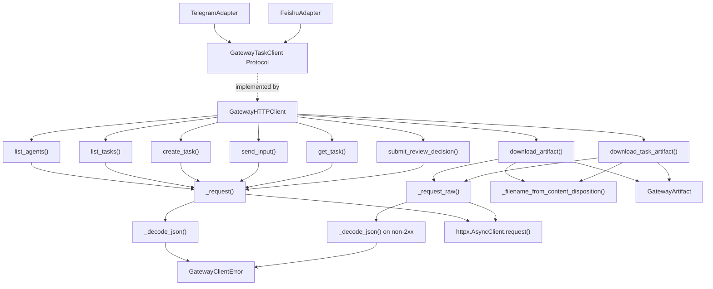
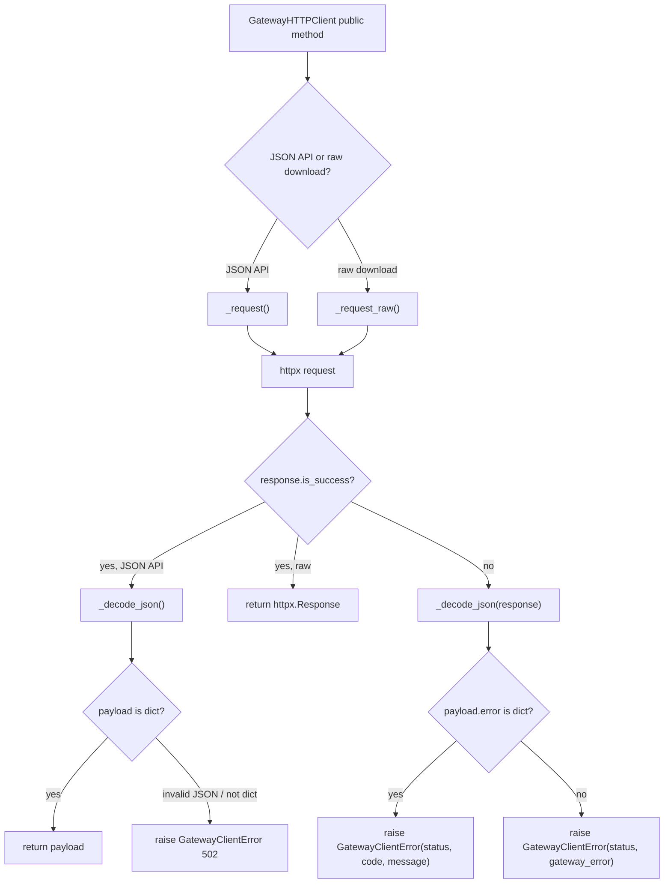
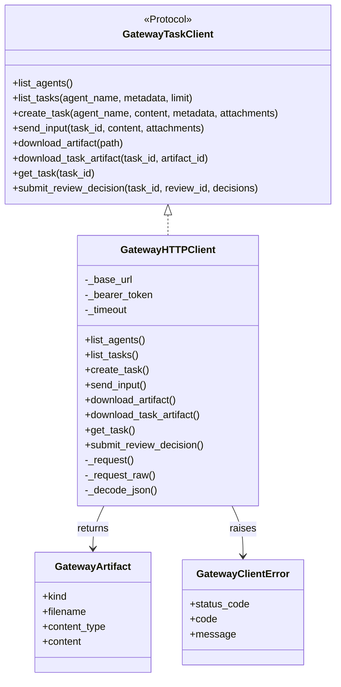

# Single File Understanding: `src/ruyi_agent/channels/gateway_client.py`

分析目标：验证“单个代码文件梳理方法”是否能帮助程序员快速理解一个陌生文件。

源码文件：`src/ruyi_agent/channels/gateway_client.py`

文件规模：278 行

文件类型：channel adapter 共享的 Gateway HTTP client / client protocol

---

## 1. 文件角色

这个文件是 **Telegram / Feishu 等外部 channel 与 Ruyi HTTP Gateway 之间的客户端边界**。

它不实现 Gateway 服务端逻辑，也不处理 Telegram / Feishu 平台协议。它只负责：

- 定义 channel adapter 需要的 Gateway client 协议。
- 用 `httpx.AsyncClient` 调用 Gateway HTTP API。
- 把 Gateway 返回的 artifact 二进制内容包装成统一对象。
- 把 Gateway 错误响应转换成 `GatewayClientError`。
- 给 Telegram / Feishu adapter 提供一个可替换、可 mock 的 client 接口。

从项目结构看，它属于：

```text
channels
  -> gateway_client.py
  -> called by telegram/adapter.py
  -> called by feishu/adapter.py
  -> talks to channels/http/routes.py over HTTP
```

---

## 2. 对外表面

| 名称 | 类型 | 行号 | 对外意义 |
|---|---:|---:|---|
| `GatewayArtifact` | dataclass | 11-16 | channel adapter 下载 Gateway artifact 后使用的统一二进制附件对象。 |
| `GatewayClientError` | exception | 19-24 | Gateway 请求失败、响应不是合法 JSON、响应结构错误时抛出的统一异常。 |
| `GatewayTaskClient` | Protocol | 27-72 | Telegram / Feishu adapter 依赖的抽象 client 协议，便于替换真实 HTTP client 和测试 fake client。 |
| `_filename_from_content_disposition` | helper function | 75-82 | 从 HTTP `content-disposition` header 解析下载文件名。 |
| `GatewayHTTPClient` | class | 85-278 | `GatewayTaskClient` 的 HTTP 实现。 |

被其他文件使用的证据：

| 使用方 | 使用内容 | 证据 |
|---|---|---|
| `channels/telegram/adapter.py` | `GatewayClientError`, `GatewayHTTPClient`, `GatewayTaskClient` | `telegram/adapter.py:17-20` |
| `channels/telegram/adapter.py` | 启动时创建 `GatewayHTTPClient` | `telegram/adapter.py:2043-2047` |
| `channels/feishu/adapter.py` | `GatewayArtifact`, `GatewayClientError`, `GatewayHTTPClient`, `GatewayTaskClient` | `feishu/adapter.py:16-21` |
| `channels/feishu/adapter.py` | 启动时创建 `GatewayHTTPClient` | `feishu/adapter.py:1977-1981` |
| `tests/unit/test_gateway_client.py` | 测试 `GatewayHTTPClient` 和 `_filename_from_content_disposition` | `test_gateway_client.py:8-11` |

---

## 3. 文件内部实体

| 实体 | 类型 | 行号 | 作用 |
|---|---:|---:|---|
| `re` | import | 3 | 用正则解析 `content-disposition` 文件名。 |
| `dataclass` | import | 4 | 定义轻量数据对象 `GatewayArtifact`。 |
| `Path` | import | 5 | artifact 下载时从路径回退推导文件名。 |
| `Any`, `Protocol` | import | 6 | 定义协议和通用 JSON payload 类型。 |
| `httpx` | import | 8 | 发起 async HTTP 请求，读取响应。 |
| `GatewayArtifact` | dataclass | 11-16 | artifact 下载结果。 |
| `GatewayClientError` | exception | 19-24 | 统一 client 错误。 |
| `GatewayTaskClient` | protocol | 27-72 | channel adapter 面向的抽象接口。 |
| `_filename_from_content_disposition` | helper | 75-82 | header 文件名解析。 |
| `GatewayHTTPClient.__init__` | method | 86-89 | 保存 base URL、bearer token、timeout。 |
| public request methods | methods | 91-194 | 对应 Gateway task/agent/artifact/review API。 |
| `_request` | private method | 196-228 | JSON API 请求公共路径。 |
| `_request_raw` | private method | 230-261 | 二进制下载请求公共路径。 |
| `_decode_json` | private method | 263-278 | HTTP 响应 JSON 解码和结构校验。 |

---

## 4. 核心行为概览

| 函数 / 方法 | 输入 | 输出 | 调用 | 副作用 | 行号 |
|---|---|---|---|---|---:|
| `_filename_from_content_disposition` | header 字符串 | 文件名或 `None` | `re.search` | 无 | 75-82 |
| `GatewayHTTPClient.list_tasks` | `agent_name`, `metadata`, `limit` | task list | `_request` | HTTP GET `/tasks` | 91-106 |
| `GatewayHTTPClient.list_agents` | 无 | agent list | `_request` | HTTP GET `/agents` | 108-111 |
| `GatewayHTTPClient.create_task` | `agent_name`, `content`, `metadata`, `attachments` | task payload | `_request` | HTTP POST `/agents/{agent_name}/tasks` | 113-128 |
| `GatewayHTTPClient.send_input` | `task_id`, `content`, `attachments` | task payload | `_request` | HTTP POST `/tasks/{task_id}/input` | 130-144 |
| `GatewayHTTPClient.download_artifact` | artifact path | `GatewayArtifact` | `_request_raw`, `_filename_from_content_disposition`, `Path(path).name` | HTTP POST `/artifacts/download` | 146-159 |
| `GatewayHTTPClient.download_task_artifact` | `task_id`, `artifact_id` | `GatewayArtifact` | `_request_raw`, `_filename_from_content_disposition` | HTTP GET `/tasks/{task_id}/artifacts/{artifact_id}/download` | 161-178 |
| `GatewayHTTPClient.get_task` | `task_id` | task payload | `_request` | HTTP GET `/tasks/{task_id}` | 180-181 |
| `GatewayHTTPClient.submit_review_decision` | `task_id`, `review_id`, `decisions` | review response payload | `_request` | HTTP POST `/tasks/{task_id}/reviews/{review_id}/decision` | 183-194 |
| `GatewayHTTPClient._request` | HTTP method, path, params, JSON | decoded JSON dict | `httpx.AsyncClient`, `_decode_json` | Network IO, raises errors | 196-228 |
| `GatewayHTTPClient._request_raw` | HTTP method, path, JSON | raw `httpx.Response` | `httpx.AsyncClient`, `_decode_json` on error | Network IO, raises errors | 230-261 |
| `GatewayHTTPClient._decode_json` | `httpx.Response` | JSON dict | `response.json()` | raises `GatewayClientError` for invalid payload | 263-278 |

---

## 5. 运行时调用关系

这个文件的核心链路不是“入口请求进来”，而是“外部 channel adapter 要操作 Gateway task 时调用 client”。



---

## 6. 数据视角

### 主要输入数据

| 数据 | 来源 | 使用位置 | 说明 |
|---|---|---|---|
| `base_url` | 创建 `GatewayHTTPClient` 时传入 | `__init__`, `_request`, `_request_raw` | 调用 `rstrip("/")`，作为 `httpx.AsyncClient(base_url=...)`。 |
| `bearer_token` | channel 启动配置 / 环境变量 | `_request`, `_request_raw` | 写入 `Authorization: Bearer ...` header。 |
| `timeout` | 创建 client 时传入，默认 `10.0` | `_request`, `_request_raw` | 传给 `httpx.AsyncClient`。 |
| `metadata` | channel adapter 调用 task API 时传入 | `list_tasks`, `create_task` | `list_tasks` 转成 query 参数；`create_task` 放入 JSON body。 |
| `attachments` | channel adapter 调用时传入 | `create_task`, `send_input` | 仅当非空时加入 `input.attachments`。 |
| `task_id` | Gateway task id | `send_input`, `get_task`, `download_task_artifact`, `submit_review_decision` | 拼接到 task 相关路径。 |
| `artifact_id` / `path` | Gateway artifact 标识 | `download_task_artifact`, `download_artifact` | 用于下载二进制 artifact。 |
| `decisions` | 人工审批决策列表 | `submit_review_decision` | 作为 `{"decisions": decisions}` 提交给 Gateway。 |

### 主要输出数据

| 输出 | 产生位置 | 类型 | 说明 |
|---|---|---|---|
| task list | `list_tasks` | `list[dict[str, Any]]` | payload 中 `items` 是 list 才返回，否则返回空 list。 |
| agent list | `list_agents` | `list[dict[str, Any]]` | payload 中 `items` 是 list 才返回，否则返回空 list。 |
| task payload | `create_task`, `send_input`, `get_task` | `dict[str, Any]` | 直接返回 Gateway JSON dict。 |
| review response | `submit_review_decision` | `dict[str, Any]` | 直接返回 Gateway JSON dict。 |
| artifact object | `download_artifact`, `download_task_artifact` | `GatewayArtifact` | 包含 `kind`, `filename`, `content_type`, `content`。 |
| client error | `_request`, `_request_raw`, `_decode_json` | `GatewayClientError` | 非 2xx 或非法响应时抛出。 |

---

## 7. 副作用和外部边界

| 副作用 | 发生位置 | 目标 | 说明 |
|---|---|---|---|
| Network IO | `_request` | Gateway HTTP API | 发送 JSON API 请求。 |
| Network IO | `_request_raw` | Gateway HTTP API | 下载 artifact 或处理二进制响应。 |
| Header 构造 | `_request`, `_request_raw` | HTTP request | 写入 bearer token；`_request` 使用 `Accept: application/json`，`_request_raw` 使用 `Accept: */*`。 |
| Error raising | `_request`, `_request_raw`, `_decode_json` | 调用方控制流 | 把 Gateway 错误或非法响应转为 `GatewayClientError`。 |

这个文件没有直接：

- 读写数据库。
- 读写本地文件。
- 修改全局状态。
- 启动后台任务。
- 发布消息队列事件。

---

## 8. 错误路径



关键细节：

- `_request` 会先调用 `_decode_json(response)`，即使 HTTP 状态码是失败也要求错误响应是 JSON dict。
- `_request_raw` 对成功响应不解码 JSON，直接返回 `httpx.Response`；只有失败时才尝试 `_decode_json`。
- `_decode_json` 将非法 JSON 或非 dict payload 统一映射为 `status_code=502` 的 `GatewayClientError`。

---

## 9. 上下游关系

### 上游调用方

| 调用方 | 调用方式 | 证据 |
|---|---|---|
| `TelegramAdapter` | 构造函数依赖 `GatewayTaskClient`，启动时传入 `GatewayHTTPClient` | `telegram/adapter.py:996`, `telegram/adapter.py:2043-2047` |
| `FeishuAdapter` | 构造函数依赖 `GatewayTaskClient`，启动时传入 `GatewayHTTPClient` | `feishu/adapter.py:814`, `feishu/adapter.py:1977-1981` |
| adapter 单元测试 | 使用 fake client 或导入 `GatewayArtifact` / `GatewayClientError` | `test_feishu_adapter.py`, `test_telegram_adapter.py` |

### 下游依赖

| 下游 | 依赖方式 | 说明 |
|---|---|---|
| Gateway HTTP API | HTTP request | `/agents`, `/tasks`, `/artifacts/download`, `/reviews/.../decision` 等路径。 |
| `httpx.AsyncClient` | library call | 每次请求临时创建一个 async client。 |
| `re` | library call | 解析文件名。 |
| `pathlib.Path` | library call | 下载 artifact 时从 path 推导默认文件名。 |

---

## 10. 测试覆盖

直接测试文件：`tests/unit/test_gateway_client.py`

| 被测行为 | 测试 | 证据 |
|---|---|---|
| quoted / bare `filename=` 解析 | `test_filename_from_content_disposition_parses_quoted_and_bare_values` | `test_gateway_client.py:31-34` |
| `download_artifact` 使用 `content-disposition` 文件名 | `test_download_artifact_uses_content_disposition_filename` | `test_gateway_client.py:37-60` |
| `download_artifact` 缺少 header 时回退到 path 文件名 | `test_download_artifact_falls_back_to_path_name_without_header` | `test_gateway_client.py:63-69` |
| `download_task_artifact` 使用 task-scoped endpoint | `test_download_task_artifact_uses_task_scoped_endpoint` | `test_gateway_client.py:72-97` |

当前直接测试明显覆盖的是 artifact 下载和文件名解析。

从源码和 `rg` 结果看，以下行为没有在 `test_gateway_client.py` 中直接覆盖，可能由 adapter 测试间接覆盖：

- `list_tasks`
- `list_agents`
- `create_task`
- `send_input`
- `get_task`
- `submit_review_decision`
- `_request` 的非 2xx JSON 错误映射
- `_decode_json` 的 invalid JSON / non-dict payload 错误映射

---

## 11. 文件内部结构图



---

## 12. 程序员阅读顺序建议

如果只给 3 分钟理解这个文件，建议按这个顺序读：

1. 先看 `GatewayTaskClient`，理解 channel adapter 需要哪些 Gateway 能力。证据：27-72。
2. 再看 `GatewayHTTPClient.__init__`，理解 client 的固定状态只有 base URL、token、timeout。证据：85-89。
3. 看 public methods 了解每个 Gateway API path 如何被包装。证据：91-194。
4. 看 `_request` / `_request_raw` 区分 JSON API 和 artifact 下载。证据：196-261。
5. 最后看 `_decode_json` 和 `GatewayClientError`，理解错误边界。证据：19-24, 263-278。

---

## 13. 不确定项 / 需要跨文件确认

这些不是单文件能完全确定的结论：

- Gateway 服务端错误响应由 `channels/http/routes.py` 统一封装为 `{"error": {"code": ..., "message": ...}}`。
- `metadata` query 参数形如 `metadata.{key}` 是否是 Gateway API 的稳定契约，需要看 HTTP route 的 query parsing。
- `GatewayTaskClient` 是否已经覆盖所有 channel adapter 需要的 Gateway 能力，需要结合 Telegram / Feishu adapter 的调用点确认。
- 每次请求都创建新的 `httpx.AsyncClient` 是否符合性能预期，需要结合 channel 请求频率和生命周期策略判断。

---

## 14. 本次单文件梳理模板是否有效

这个文件用来验证单文件梳理时，至少需要保留这些视角：

- 文件角色：它在系统里是什么边界。
- 对外表面：它暴露哪些类、协议、函数。
- 内部实体：文件里到底有什么。
- 核心行为：每个 public method 做什么、调用谁、有什么副作用。
- 数据视角：输入、输出、错误对象、artifact 对象。
- 副作用视角：HTTP 请求和异常抛出。
- 上下游关系：谁调用它，它调用谁。
- 测试覆盖：哪些行为有测试，哪些没有直接测试。
- Mermaid：一张行为图 + 一张结构图。
- 不确定项：跨文件才能确认的地方不硬编。
