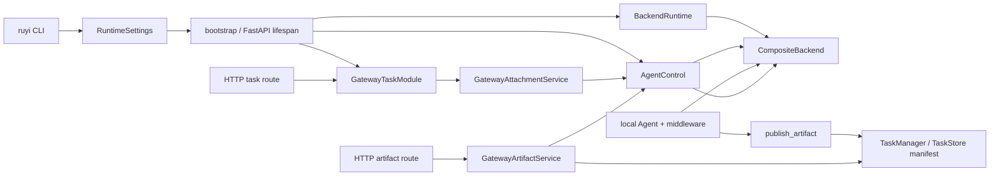

# Execution backend 与 workspace 边界

本文记录当前实现中 execution backend、workspace、attachment ingress 和 artifact
文件流之间的边界。事实来源是代码和行为测试；这里的 `host workspace`、`backend
path` 和 `Task` 是三个不同层次的概念。

- **host workspace**：`RuntimeSettings.backend.workspace` 中解析后的绝对主机
  `Path`，由配置/路径层选择。
- **backend path**：Agent 文件工具看到的 POSIX 绝对路径，例如 `/report.xlsx`。
  它是 backend 命名空间中的路径，不是用户机器上的路径。
- **Task**：runtime/Gateway 跟踪的任务身份。artifact 的 durable metadata 附着在
  该 Task 上，artifact bytes 仍由 backend 持有。

## 负责与不负责

| 边界 | 负责的当前行为 | 不负责的行为 |
| --- | --- | --- |
| [`config/paths.py`](../../src/ruyi_agent/config/paths.py) 与 [`runtime_settings.py`](../../src/ruyi_agent/config/runtime_settings.py) | 发现 `RUYI_HOME`、解析 host workspace、规范化配置路径、校验 backend kind，并产出 immutable `RuntimeSettings` | 不执行 shell，不读取或下载 artifact，不替代 backend 或 Gateway 的路径检查 |
| [`integrations/backend/runtime.py`](../../src/ruyi_agent/integrations/backend/runtime.py) | 创建 local/Daytona backend，统一暴露 `BackendRuntime`，提供 backend home/skills 路径，并在关闭时停止持有的 Daytona sandbox | 不拥有 HTTP、Task route、Task public response、tool permission/approval 或任意 host ACL |
| deepagents `BackendProtocol`/`CompositeBackend` 与本项目传入的 default backend | 提供文件读写、搜索、批量 upload/download，以及 default backend 的 shell execute 契约 | `CompositeBackend` 不会把 execute 路径路由或变成安全隔离；local shell 也不因 virtual path 而变成 sandbox |
| [`runtime/bootstrap.py`](../../src/ruyi_agent/runtime/bootstrap.py) | 组合 backend、Agent、MCP、checkpointer、SQLite stores、`AgentControl` 和 Gateway，并管理进程生命周期 | 不把所有路径、Task 状态或错误投影的 ownership 归给 bootstrap |
| [`gateway/attachments.py`](../../src/ruyi_agent/gateway/attachments.py) | 校验 Gateway attachment 输入、解码、命名、构造 inbox backend path、调用 runtime upload，并生成给 Agent/route 使用的 metadata | 不负责 channel 外部媒体下载、tool permission/approval、对象存储或 host 文件系统的完整 ACL |
| [`runtime/middleware/artifact_publishing.py`](../../src/ruyi_agent/runtime/middleware/artifact_publishing.py) 与 [`runtime/delegation/local_executor.py`](../../src/ruyi_agent/runtime/delegation/local_executor.py) | 在 tracked Task 上校验 backend path、按需读取 bytes、构造并登记 artifact manifest | 不负责 Gateway HTTP auth、Task artifact 公共投影，也不单独拥有所有路径安全规则 |
| [`gateway/artifacts.py`](../../src/ruyi_agent/gateway/artifacts.py) | 根据 manifest 找到 artifact、再次做 workspace path 检查、从 backend 读取并按上限返回 bytes | 不负责 artifact bytes 的长期存储、对象存储、manifest 与当前文件内容的完整一致性证明 |
| [`channels/http/artifact_routes.py`](../../src/ruyi_agent/channels/http/artifact_routes.py) 与 HTTP middleware | 把 Gateway artifact service 接到 HTTP response；业务 bearer auth 属于 HTTP 边界 | 本文不定义 Gateway HTTP auth；路由也不绕过 Gateway service 直接访问 backend |
| `TaskManager`/`TaskStore` | 在生产 bootstrap 的 durable Task 边界保存 `PublishedArtifact` manifest 及相关事件 | 不把文件 bytes 写入 Task SQLite；不拥有 channel delivery 或未来的存储方案 |

因此，本文不宣称某一个模块拥有全部 path security：config paths、backend 的
filesystem 实现、Gateway attachment/artifact service、artifact middleware 和 HTTP
层各自只检查自己看到的边界；local shell 还可以越过文件工具的 virtual root。

## 入口调用方与组件/数据流

典型 local Task 的调用关系如下。Daytona 只替换 backend 实现，不改变上层的
`BackendProtocol`/`CompositeBackend` 形状。



入口的职责边界是：

1. [`entrypoints/main.py`](../../src/ruyi_agent/entrypoints/main.py) 调用
   `configure_runtime_environment`；配置层选择 host workspace，解析成 typed
   settings。`LOCAL_BACKEND_ROOT`、`BACKEND_KIND` 等是向兼容消费者投影的 env，
   不是 TOML 的配置权威。
2. [`bootstrap_application`](../../src/ruyi_agent/runtime/bootstrap.py) 创建共享
   `BackendRuntime`，再将它的 backend 传给 `AgentControl` 和 Agent middleware，
   同时创建 Gateway service。Telegram/Feishu adapter 通过 Gateway client 访问
   Gateway HTTP，不直接拿 `AgentControl` 或 backend。
3. local 的 task create/input 由 Gateway task service 先处理 attachment，再进入
   route/runtime；remote-ref route 将 attachment DTO 转发给上游 A2A，不经过本地
   `inbox/gateway` upload（见[附件 ingress](#attachment-ingress)）。
4. local Agent 的编译边界是
   [`LocalTaskExecutor.compile_agent`](../../src/ruyi_agent/runtime/delegation/local_executor.py)：
   它把 backend、backend workspace root 和 `register_artifact` callback 传给
   [`create_runtime_agent`](../../src/ruyi_agent/runtime/agent_factory.py)。Agent 的
   文件工具和 `publish_artifact` 都因此使用 backend namespace。
5. artifact download 只能从 Gateway service 进入：task-scoped 请求先查 route 和
   Task manifest，再由 artifact service 重新验证 path 并按需读取 backend bytes。

## BackendRuntime 与 CompositeBackend 契约

### BackendProtocol

deepagents 的 `BackendProtocol` 是 runtime 使用的文件 backend 契约。当前调用面包括
`ls`、`read`、`grep`、`glob`、`write`、`edit`、`upload_files` 和
`download_files`，以及对应的异步包装；文件方法的输入是 backend path，批量
upload/download 的结果按输入顺序返回 `FileUploadResponse` 或
`FileDownloadResponse`。后两者用 `error` 表示 `file_not_found`、`permission_denied`、
`is_directory`、`invalid_path` 等标准错误，bytes 成功时放在
`FileDownloadResponse.content`。

实现 shell 的 backend 还要满足 `SandboxBackendProtocol`：提供 `id` 和
`execute(command, timeout=...)`/`aexecute`，返回 `ExecuteResponse(output,
exit_code, truncated)`。这是“可执行 backend”的接口，不等于所有实现都提供同样
的隔离级别。

### CompositeBackend

`BackendRuntime.backend` 是一个 `CompositeBackend`，其当前组装参数为：

- `default`：local 的 `RuyiLocalShellBackend`，或 Daytona 的
  `AutoStartDaytonaSandbox`；
- `routes={}`：当前 Ruyi 没有额外的 memory/filesystem route，但
  `CompositeBackend` 契约支持按最长 path prefix 把文件操作转给不同 backend；
- `artifacts_root=home_dir`：为 deepagents 的 artifact/offload 相关能力提供
  backend namespace 的根。

文件操作按 path route 选择 backend，未命中的路径落到 `default`；批量
upload/download 会按 backend 分组，随后按原始输入顺序还原结果。`execute` 是例外：
它始终只委托给 `default`，不会根据 command 或某个文件 path 选择 route。因此，
`CompositeBackend` 是统一的文件/执行 façade，不是 policy、approval 或 sandbox
本身。

### BackendRuntime

[`BackendRuntime`](../../src/ruyi_agent/integrations/backend/runtime.py) 保存上层
只需知道的运行信息：

| 字段 | 当前语义 |
| --- | --- |
| `kind` | `local` 或 `daytona` |
| `backend` | 上述 `CompositeBackend`，供 Agent/runtime/Gateway 文件操作使用 |
| `home_dir` | backend namespace 的稳定根；local 为 `/`，Daytona 为 sandbox user home |
| `skills_root` | 选中的 skill view 在 backend namespace 中的根 |
| `_sandbox` | 可选的 Daytona sandbox；local 为 `None`，仅由 `close()` 使用 |

上层只调用 `create_backend_runtime(settings)`，不自行创建 Daytona SDK 或
`LocalShellBackend`。创建失败向上抛出；运行期间 backend 自己通过结果对象或执行
响应报告文件/命令失败。

## 两套 workspace namespace

### host namespace：配置与来源文件

`resolve_ruyi_paths` 先发现 `RUYI_HOME`，再得到 `config_dir`、`data_dir`、
`skills_dir` 和默认 `workspace`。runtime TOML 的 workspace 选择顺序是：

1. CLI/调用方传入的 `workspace` override；
2. `[backend].workspace`；
3. `RUYI_WORKSPACE`；
4. 路径发现得到的当前目录或默认 workspace。

选中的路径会 `expanduser()`、解析为绝对 `Path`，成为
`settings.backend.workspace`（`settings.workspace` 是兼容 accessor）。
`LOCAL_BACKEND_ROOT` 是 `apply_runtime_settings_to_env` 的兼容投影；它不会反过来
覆盖 canonical `[backend].workspace`。配置层还会在 POSIX 上拒绝 Windows-style
`RUYI_HOME`/workspace 输入。

bootstrap 使用这套 host path 构造
[`SkillCatalog`](../../src/ruyi_agent/runtime/skills/catalog.py)，扫描 host-side
skill roots。它不会因此把整个 host workspace 直接暴露给 Agent。

### backend namespace：Agent 可见路径

Agent 的 filesystem middleware、attachment service 和 artifact middleware 使用
POSIX backend path；其根由 `BackendRuntime.home_dir` 决定。bootstrap 将
`settings.backend.workspace` 作为 `host_workspace_root` 传给 SkillCatalog，同时
将 `home_dir` 作为 `AgentControl.workspace_root`、skill sync view root 和 artifact
middleware 的 workspace root。两者不能混写：

| backend | host workspace | backend path 的实际落点 | `home_dir` / `skills_root` |
| --- | --- | --- | --- |
| local | `settings.backend.workspace`，例如 `/work/project` | `/report.txt` 通过 virtual root 映射到 `/work/project/report.txt` | `/`；`/.ruyi_agent/runtime/skill-views` |
| Daytona | 仍可有配置的 host workspace，供 host-side skill catalog 使用 | `/home/.../report.txt` 由 Daytona sandbox filesystem 处理；当前代码不把 host workspace 挂载到 sandbox | `sandbox.get_user_home_dir()`；`<home_dir>/.ruyi_agent/runtime/skill-views` |

host skill 文件若要被 Agent 使用，会由
[`SkillSyncer`](../../src/ruyi_agent/runtime/skills/sync.py) 从 host 读取并通过
backend upload 到 backend 的 skill view；Agent 读取的是该 view 中的 backend path。

### 分层 path boundary

这些层次各有自己的检查点：

- config paths 负责配置来源、绝对化和平台风格校验；
- local filesystem 的 `virtual_mode=True` 负责文件工具路径相对 virtual root 的
  解析、`..`/`~` 和解析后越界检查；
- [`GatewayAttachmentService`](../../src/ruyi_agent/gateway/attachments.py) 与
  [`GatewayArtifactService`](../../src/ruyi_agent/gateway/artifacts.py) 对进入
  Gateway 的 backend path 做绝对、无 `..` 且位于 runtime workspace root 内的检查；
- `ArtifactPublishingMiddleware` 对 Agent 传入的 path 做自己的 POSIX、绝对、无
  `..` 且在 middleware root 内的检查；
- backend 最终执行文件操作；Daytona 的 filesystem boundary 由远端 sandbox
  提供，local shell 则不受 virtual file path 检查约束。

这些检查不是任意 host ACL：没有一个模块可宣称能约束 local shell 对主机上任意
可访问路径的访问。

## Local backend

`_create_local_backend_runtime` 从 typed settings 读取：
`backend.workspace`、`backend.local.timeout`、`max_output_bytes` 和
`inherit_env`，构造
[`RuyiLocalShellBackend`](../../src/ruyi_agent/integrations/backend/runtime.py)，
参数固定为 `root_dir=host workspace`、`virtual_mode=True`。再把它作为
`CompositeBackend.default`，并设置 `home_dir="/"`。

### 文件工具的 virtual root

local 文件工具看到 `/nested/example.txt`，FilesystemBackend 会把它解释为
`<settings.backend.workspace>/nested/example.txt`。virtual mode 会拒绝 path
traversal，并确认解析后的文件仍在 `root_dir` 内；读/写/upload/download 走的是这
套文件操作边界。测试还覆盖了对 host workspace 外文件的普通 backend read 被拒绝。

该 virtual root 只是文件 path semantics 和 path-based guardrail。它不改变当前进程
的 OS 权限，也不限制所有可能的 filesystem side effect。

### shell 只是 cwd，不是 sandbox

`RuyiLocalShellBackend.execute` 调用 `subprocess.run(..., shell=True)`，将
`root_dir` 设置成 child process 的 `cwd`。因此：

- command 默认从 host workspace 启动，但 command 中的绝对路径、`..`、网络、进程
  创建和其它 shell 能力不由 virtual root 拦截；
- command 继承当前用户的宿主机权限；当前实现没有 Daytona 式进程/文件系统隔离，
  也没有在 backend 层建立任意 host ACL；
- `inherit_env=true`（typed local setting 默认值）使 shell 环境从当前进程
  `os.environ` 复制；`false` 时 runtime 不额外注入 env，使用空的 backend env。
  因而 local shell 可能看到进程中的 secrets，不能把 env 继承当成 secret 隔离；
- 默认 command timeout 为 120 秒，输出上限默认 100,000 bytes；超时返回 exit
  code 124，输出过长标记 `truncated`。本项目还明确按 bytes 读取并尝试 UTF-8/locale
  解码，避免平台 code page 破坏结果。

选择 local backend 的前提是信任 Agent 与 command 输入，并接受主机权限边界。
tool permission/approval（包括 HumanApproval middleware）不属于本文契约。

## Daytona backend

### 创建、复用与启动

`_create_sandbox(settings)` 从 `settings.backend.daytona` 读取 `api_key`、
`api_url`、`target` 和 `sandbox_name`，创建 `DaytonaConfig` 与 `Daytona` client，
然后按固定 name：

1. `daytona.get(sandbox_name)` 查找现有 sandbox；
2. 找到但 `state` 不是 `STARTED` 时调用 `sandbox.start()`，等待 SDK 的 start
   完成；这就是跨进程启动时的 reuse/start 路径；
3. 若 get 抛出 `DaytonaNotFoundError`，用 `CreateSandboxFromSnapshotParams`
   （`name=sandbox_name`、`language="python"`）调用 `daytona.create`；SDK 创建
   路径会等待 sandbox 进入 started；
4. get 的其它错误不被当作 not-found，不会静默创建另一个 sandbox。

创建成功后，runtime 调用 `sandbox.get_user_home_dir()` 得到 backend `home_dir`，
用它创建 `AutoStartDaytonaSandbox` 与 `CompositeBackend`，并保存原始 sandbox 供
关闭。当前创建参数没有把 host workspace 或 host env 作为挂载/注入传入。

### health、按需恢复与隔离边界

`AutoStartDaytonaSandbox` 把“操作前可用”收口在 backend boundary：

- 每 2 秒 TTL 最多调用一次 `refresh_data()`；
- `STARTED` 直接继续；`STARTING` 调用 `wait_for_sandbox_start()`；
  `STOPPED` 调用 `start()`；`ERROR` 且 `recoverable` 时调用 `recover()`；
- 其它 state 返回 unavailable 错误文本；准备过程中的异常也转成可读错误，避免
  一次 sandbox 抖动直接让 Agent tool 抛出未翻译异常；
- `execute` 在准备失败时返回 `ExecuteResponse`（exit code 1），upload 以
  `invalid_path` 响应，download 以 `file_not_found` 响应；准备成功才调用
  `DaytonaSandbox` 的远端 process/filesystem。

Daytona 的 shell、文件读写和本项目通过 backend 读取的 artifact bytes 都在
Daytona sandbox 中执行/保存，因而与 Gateway 进程所在 host 文件系统形成隔离边界。
这不等于本项目实现了 Daytona 服务内部的任意 network policy、组织 ACL 或资源
策略；这些由 Daytona/部署环境决定，也不由本文定义。

### 停止与 close

`BackendRuntime.close()` 只处理它持有的 `_sandbox`：先 `refresh_data()`，若 state
不在 `STOPPED`、`STOPPING`、`ARCHIVED`、`DESTROYED`，调用 `sandbox.stop()`。如果
停止竞态导致 Daytona 报告 “Sandbox is not started”，该特定错误被吞掉；其它
`DaytonaError` 继续向上抛出，避免隐藏真实清理失败。local runtime 没有 sandbox，
因此 `close()` 不会停止或撤销 host process。

## bootstrap 生命周期

### 启动

[`bootstrap_application`](../../src/ruyi_agent/runtime/bootstrap.py) 是 composition
和 lifecycle root，顺序是：

1. 先调用 `create_backend_runtime(settings)`，因为 Agent 的 home、skills 和执行
   状态路径依赖 backend；
2. 以 host `settings.backend.workspace` 创建并扫描 `SkillCatalog`，以 backend
   `home_dir` 创建 `SkillSyncer`；
3. 加载 Agent、Provider、permission、MCP 配置并刷新 MCP registry；
4. 打开 LangGraph `AsyncSqliteSaver`，建立 Gateway route/command、Task、mailbox、
   review audit stores；
5. 用 backend、checkpointer、mailbox、permission policy、`backend_kind` 和
   `workspace_root=home_dir` 创建 `AgentControl`，恢复 pending mailbox task，并
   启动 mailbox recovery；
6. 创建 `GatewayTaskModule`，由 FastAPI lifespan 将 Gateway service 放到
   `app.state`，之后才把 `gateway_ready` 置为 true。

### 关闭与早期失败

FastAPI lifespan 在停止接收新业务请求时先把 `gateway_ready` 置为 false。随后
bootstrap 按依赖逆序释放：

```text
AgentControl.close()
  -> ReviewAuditStore.close()
  -> MailboxStore.close()
  -> TaskStore.close()
  -> GatewayCommandStore.close()
  -> GatewayRouteStore.close()
  -> AsyncSqliteSaver context close
  -> BackendRuntime.close()
```

因此 worker 在 checkpointer/stores/backend 仍可用时完成停止和必要的 Task 状态
处理；最后才关闭 Daytona sandbox（local 为 no-op）。如果 skill scan、config、MCP
或 Gateway assembly 在 yield 前失败，外层 `finally` 仍保证已经创建的 backend
只关闭一次；不会把半初始化的 runtime 暴露为 ready。生命周期顺序和 early-failure
清理由 [`test_runtime_bootstrap_shutdown.py`](../../tests/unit/test_runtime_bootstrap_shutdown.py)
覆盖。

## Attachment ingress

### 输入、名称与 bytes

Gateway `AttachmentInput` 要求非空 `name`（最多 255 字符）和非空
`data_base64`；`content_type` 可选（最多 255 字符），`kind` 限定为 `image`、
`document`、`audio`、`video` 或 `file`。一个 `TaskInput` 最多 10 个 attachment，
且必须有非空 text 或至少一个 attachment。

local create/input 进入
[`GatewayAttachmentService.prepare`](../../src/ruyi_agent/gateway/attachments.py)
后按以下顺序处理：

1. 名称先把 `\\` 当作 `/`，取 basename、去空白；空名、`.`、`..` 回退为
   `attachment`。随后只保留字母、数字、`.`、`-`、`_`，其它字符变成 `_`，并
   去掉首尾 `.`/`_`；结果为空再次回退为 `attachment`。这是 ingress 命名规则，
   不是对 host path 的通用 ACL。
2. 对 `data_base64` 使用 `base64.b64decode(..., validate=True)`；格式错误产生
   `invalid_attachment`。大小按解码后的 bytes 计算，超过 Gateway context 的
   `attachment_max_bytes`（默认 20 MiB）产生 `attachment_too_large`。
3. backend path 固定为：

   ```text
   <backend workspace root>/inbox/gateway/<batch_id>/<index:02d>-<sanitized-name>
   ```

   create 使用 Gateway Task ID 作为 `batch_id`；有幂等 key 的 input 使用 command
   ID；无幂等 key 的 input 使用新 UUID。service 还要求该路径在 normalized
   runtime workspace root 与 `inbox/gateway` 下。
4. 调用 `AgentControl.upload_files`，检查返回数量必须与输入数量相等，并逐项检查
   `error`。不完整或任一 upload error 产生 `attachment_upload_failed`；代码没有
   提供已成功上传 bytes 的回滚/删除契约，因此调用方不能假定失败后 inbox 已清空。
5. 成功后把每项 `name`、backend `path`、`content_type`、`kind` 作为 attachment
   metadata：一份追加到送给 Agent 的内容 `Uploaded attachments:` 段落，一份以
   `name|path|content_type|kind` 行写入 Gateway route metadata。Task artifact 公共
   投影不在本文范围内；metadata 不包含
   base64 bytes。

remote-ref create/input 不走这条本地 upload 路径，而是把 DTO 形式的 attachment
转发到 remote route 的上游；远端如何持有它们属于 remote Gateway/A2A 边界。

### Attachment 错误边界

无效 base64 是请求错误，过大是大小限制错误；workspace root 缺失或不规范是
`runtime_unavailable`，path 越界是 `workspace_path_forbidden`，backend 返回缺失/不
完整结果则是 upload failure。HTTP status 的映射由
[`error_handlers.py`](../../src/ruyi_agent/channels/http/error_handlers.py) 所在
HTTP 层拥有，本文只记录 Gateway error code，不把 HTTP auth 纳入 attachment
ownership。

## Agent artifact publishing

### tracked Task、backend path 与 confinement

只有 `LocalTaskExecutor.compile_agent` 提供 `register_artifact` callback 时，runtime
middleware stack 才加入
[`ArtifactPublishingMiddleware`](../../src/ruyi_agent/runtime/middleware/artifact_publishing.py)。
Agent 调用 `publish_artifact` 时：

1. middleware 从运行时 config 的 `configurable` 或 `metadata` 读取非空 `task_id`；
   没有该身份返回 `no_active_task`。callback 随后通过 `TaskManager.get_task` 解析
   tracked Task，artifact 不是一个脱离 Task 的全局文件登记。
2. `path` 必须是 backend namespace 中的绝对 POSIX path：拒绝 `\\`、Windows
   drive path、相对路径、`..`，并要求位于 middleware 的 normalized
   `workspace_root`。例如 local backend 下 Agent 应传 `/report.html`，不能传
   `C:\\Code\\report.html`，也不能把 host workspace 名称拼进 backend path，除非
   那个目录确实存在于 backend namespace。
3. middleware 调用 `backend.download_files([path])` 读取当前 bytes；backend error、
   空结果或非 bytes 视为 `file_not_found`。超过 middleware `max_bytes`（默认
   50 MiB）产生 `file_too_large`，大小按实际 bytes 计算。
4. 形成待登记 metadata：`path`、安全 basename `name`（未传时取 path basename）、
   可选非空 `caption`、显式或 MIME guess 的 `content_type`、实际 `size`。名称只
   是 delivered filename 的 basename 处理，不能把它当作 path confinement。
5. [`LocalTaskExecutor.register_artifact`](../../src/ruyi_agent/runtime/delegation/local_executor.py)
   为当前 Task/run 生成 `art_<uuid>`，把 `run_count` 从当前 `TaskRecord` 带入
   `PublishedArtifact`，再交给 `TaskManager.add_artifact`。登记异常返回
   `artifact_registration_failed`。

middleware 的 path 检查与 Gateway 的下载检查是两次不同的边界。TaskManager 的
登记入口保存 callback 传入的 manifest；它不是 middleware 的替代品，也不宣称能
单独重做所有 path validation。

### artifact bytes 与 durable metadata

两种数据故意分离：

| 数据 | 当前持有者与生命周期 |
| --- | --- |
| artifact bytes | backend namespace 中的文件；middleware publish 时读取一次，Gateway download 时再次从 backend 读取；bytes 不写入 Task SQLite manifest |
| durable metadata | `PublishedArtifact(artifact_id, path, name, caption, content_type, size, run_count)` 附着在 `TaskRecord.artifacts`，生产 TaskStore 序列化到 `artifacts_json`；TaskManager 还可通过 Task event ledger 记录登记事件 |

因此重启后可恢复的首先是 manifest；文件能否再次下载取决于相同 backend 的可用
状态与文件仍存在。manifest 的 `size` 是发布时实际读取的 bytes 长度，Gateway
下载只重新检查当前 bytes 是否存在以及是否超过 `artifact_max_bytes`（默认 50
MiB），不会把当前文件长度当作已经验证的内容 hash，也没有在这里实现 manifest
size 与当前 bytes 的强一致性校验。Task artifact 公共投影（DTO/HTTP response 的
展示形状）不是本文负责的内容。

## Gateway artifact download

Gateway 有两种进入方式，但都由
[`GatewayArtifactService`](../../src/ruyi_agent/gateway/artifacts.py) 读取 backend：

- 直接按 path 下载：先 `ensure_workspace_path`，再调用
  `control.download_files([path])`；
- 按 `task_id` + `artifact_id` 下载：先通过 route 找到 Task record，从其 durable
  manifest 查找 artifact，再调用上面的 path download。manifest 找不到时不访问
  backend。

两条路径在 backend read 前都会再次验证 absolute normalized workspace path；返回
为空、backend error 或 `content is None` 都统一为 `artifact_not_found`。实际 bytes
按需读取，超过 Gateway artifact limit 返回 `artifact_too_large`。task-scoped 下载
使用 manifest 中的 delivered `name` 和 `content_type`；直接 path 下载按文件名猜
MIME。HTTP response header 和 bearer auth 由 HTTP route/middleware 层处理，不能被
理解为 service 的 path policy。

“再次验证”很重要：publish 时通过 middleware 的路径检查并不会让未来的 Gateway
下载跳过自己的检查；反过来，Gateway 下载也不会重新登记或改变 Task manifest。

## 状态、错误、恢复与关闭

### 状态生命周期

```text
typed settings
    -> backend runtime created
    -> backend ready (local root / Daytona STARTED)
    -> file/execute/upload/download operations
    -> (Daytona refresh: STARTING/STOPPED/ recoverable ERROR -> start/wait/recover)
    -> bootstrap shutdown: control/stores/checkpointer close
    -> BackendRuntime.close: Daytona stop, local no-op
```

attachment 和 artifact 的文件流分别是：

```text
attachment input
    -> validate name/base64/decoded size
    -> backend inbox upload
    -> Task input metadata

backend file
    -> tracked Task + absolute path/confinement
    -> read bytes and size check
    -> durable manifest registration
    -> later Gateway path re-check
    -> on-demand backend download
```

### 错误分类与恢复动作

| 层 | 当前错误/行为 | 恢复边界 |
| --- | --- | --- |
| config | unknown shape、无效 workspace、backend kind、Daytona URL/参数会在 settings 边界报 `ConfigError`/`ValueError` | 修正配置并重新 configure；backend 尚未创建时不进入 ready |
| local file backend | 文件方法返回 `invalid_path`、`file_not_found`、`permission_denied`、`is_directory` 等；virtual path 越界可能返回错误或抛出 path validation error | Agent 可修正 backend path；这不会限制 shell 的 host 能力 |
| local execute | shell exception/非零 exit/timeout 以 `ExecuteResponse` 返回；进程运行在宿主机权限下 | 由调用方决定重试或人工处理；本文不提供 approval policy |
| Daytona operation | health refresh 后可对 `STARTING` wait、`STOPPED` start、recoverable `ERROR` recover；不可用状态转换为普通 execute/upload/download 失败响应 | 后续 backend 调用可再次触发 TTL health；不可恢复状态需外部修复或重建，create/get 的非 not-found SDK 错误向上抛出 |
| attachment | invalid base64、decoded bytes 超限、workspace path 不可信、upload 结果缺项/报错 | 请求可在验证错误时修正并重试；代码没有宣称 upload batch 具备 rollback |
| artifact publish | no tracked Task、host/relative/traversal path、backend 文件缺失、bytes 超限、登记失败 | Agent 依据 JSON tool error 修正 path/文件/大小；manifest 只在登记成功后追加 |
| Gateway download | manifest/path 不可读、backend bytes 缺失或当前 bytes 超限 | 返回 not-found/too-large；不自动改写 manifest，也不把旧的 metadata 当作 bytes |
| bootstrap close | control、stores、checkpointer、Daytona stop 的关闭错误遵循各自边界；特定 “not started” stop race 可忽略，其它清理错误不吞 | 由 lifespan/宿主记录并处理；早期启动异常仍关闭已创建 backend |

Task、route、command 的更广泛 uncertain/replay 状态属于 Gateway/runtime 控制面；
这里仅说明 backend 文件 bytes 和生命周期，不把它们重新定义为 backend ownership。

## Trust 与 secret 边界

- local backend 是宿主信任模型：`root_dir`/virtual mode 只约束文件工具的 path
  解析，shell 使用宿主用户权限和可选继承的 `os.environ`。不应把 local 用于不信任
  的输入或不信任的代码执行；本文不承诺任意 host ACL。
- Daytona backend 的隔离对象是 sandbox：Agent command、backend 文件和由它们读取
  的 artifact 位于远端 sandbox；host workspace 不是由本项目自动挂载的 backend
  root。Daytona 服务自身的网络、组织、资源和生命周期策略在本文之外。
- `RuntimeSettings` 只在 config/integration 边界读取 Daytona API key、Provider
  credential、Gateway token 等 secret；Daytona key 用于构造 `DaytonaConfig`，不应
  进入 Task metadata、artifact manifest、wire DTO 或普通错误文本。local
  `inherit_env=true` 仍可能把进程已有 secret 暴露给 shell，这是选择 local 的风险，
  不是 secret redaction 契约。
- Gateway HTTP bearer auth、team-console session auth、tool permission/approval、
  任意 host ACL 和对象存储都不是本系统篇幅内由 backend 文档定义的能力。HTTP
  route 可要求 auth，但 auth 成功不等于 path 自动安全；文件 path 仍须经过相应
  Gateway/backend/middleware boundary。

## 测试证据

本文未把未覆盖的 live Daytona API 行为写成测试事实。当前可核对的证据包括：

- [`tests/unit/test_backend_runtime.py`](../../tests/unit/test_backend_runtime.py)：
  local factory 暴露 `CompositeBackend`、`home_dir=/` 和固定 skill root；virtual
  file upload/download 映射到 host workspace，普通 read 不能越界；`pwd` 证明 shell
  的 cwd 是 host workspace；UTF-8 output decoding 和 unknown backend kind 也有覆盖。
- [`tests/unit/test_runtime_settings.py`](../../tests/unit/test_runtime_settings.py)：
  `[backend]` workspace 与 CLI/env precedence、local/Daytona typed settings、
  backend kind 兼容拼写与非法值、Windows-style path/strict source shape 有覆盖。
- [`tests/unit/test_ruyi_paths.py`](../../tests/unit/test_ruyi_paths.py)：
  `RUYI_HOME`/project/user home 发现和 POSIX 下 Windows-style workspace 拒绝。
- [`tests/unit/test_gateway_http_core.py`](../../tests/unit/test_gateway_http_core.py)：
  attachment 名称清理、base64 upload、仅 attachment input、inbox path 注入、非法
  workspace root、不完整 upload；direct/task artifact download、越界拒绝和当前
  backend bytes 返回。
- [`tests/unit/test_artifact_publishing_middleware.py`](../../tests/unit/test_artifact_publishing_middleware.py)：
  tracked task config、backend absolute path、host path rejection、实际 bytes
  size/MIME/name metadata、missing file 和 Agent tool invocation。
- [`tests/unit/test_async_subagent_local_executor.py`](../../tests/unit/test_async_subagent_local_executor.py)：
  `register_artifact` 为当前 run 生成 manifest 并附着在 `TaskRecord`。
- [`tests/unit/test_task_store.py`](../../tests/unit/test_task_store.py)：
  `PublishedArtifact` manifest 在 TaskStore 重开后保持可读；这证明 metadata
  persistence，不证明 backend bytes persistence。
- [`tests/unit/test_runtime_bootstrap_shutdown.py`](../../tests/unit/test_runtime_bootstrap_shutdown.py)：
  control → stores → checkpointer → backend 的关闭顺序，以及 skills/config/MCP
  早期启动失败时 backend 只关闭一次。

按仓库约束，本次文档变更只需静态检查和 `git diff --check`；没有把 pytest/full
suite 当作本次文档证据。

## 文档同步触发

以下当前行为变化必须同步本文和对应测试/链接：

- 新增或改变 backend kind、`BackendRuntime` 字段、`CompositeBackend` route/execute
  语义、local virtual root、shell cwd/权限/env 继承，或 Daytona get/create/start/
  recover/health/stop 生命周期；
- 改变 config path precedence、host/backend namespace、skill source-to-view upload
  或 workspace path validation 的 ownership；
- 改变 AttachmentInput 字段/数量限制、name sanitizer、base64 解码、decoded-size
  limit、inbox path、upload batch/error 或 remote-ref 分流；
- 改变 Agent artifact tool 的 tracked Task 要求、absolute backend path/confinement、
  read/size/MIME/name metadata、manifest persistence，或 Gateway download 的再次
  验证/on-demand bytes 读取；
- 改变 bootstrap ready/close 顺序、Daytona/local secret boundary、错误 code 或
  链接所指向的当前入口。

同步时应同时核对实现和行为测试；不要在本文中添加未实现的未来存储、对象存储或
通用 host ACL 设计。
