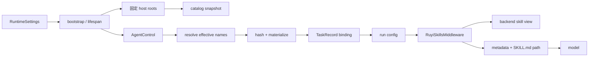

# Skills 系统

本文描述当前 Ruyi Agent 的 skills 边界：host 上的 `SKILL.md` 如何进入运行时
catalog，Agent 声明如何得到一次 Task 的 effective skills，选中的文件如何复制到
backend view，以及模型如何看到这份 view。事实来源是当前实现和行为测试；本文
记录现有契约，不定义外部 skill 标准或未来的管理功能。

## 负责与不负责

Skills 子系统负责：

- 在固定的 host roots 中发现并解析有效的 `SKILL.md`，形成一次 bootstrap 期间的
  catalog snapshot；
- 解析 local Agent 的 `skills` 声明，计算 `none`、`inherit` 或显式列表对应的
  effective skill names，并在 parent-child delegation 中传递已计算的 names；
- 按 skill 文件内容和选择顺序计算 hash，把选中的 host 文件物化为 backend
  namespace 中的 view，并写入 view manifest；
- 将 Task 的 effective names、backend view path 和 view hash 写入
  [`TaskRecord`](../../src/ruyi_agent/task_models.py)，使它们随 Task 持久绑定；
- 通过 [`RuyiSkillsMiddleware`](../../src/ruyi_agent/runtime/middleware/ruyi_skills.py)
  从该 view 读取 metadata，并把可读取的 `SKILL.md` backend path 告诉模型。

它不负责：

- 安装、外部下载、更新、删除或热重载 skills。当前的 backend upload/download
  只是把已选 host 文件复制到运行时 view、再从 view 读取内容，不是 skill
  包管理器；它也不会自动清理内容变化后留下的历史 backend view；
- tool permission、approval 或 `allowed-tools` 的强制执行。`allowed-tools` 目前
  只在 middleware 中解析成 metadata，不会据此过滤或拒绝 tool call；
- 通用 filesystem/tool runtime、workspace 的完整 ACL、shell 隔离，或 backend
  的生命周期。这些边界见
  [execution backend 与 workspace](./execution-backends-and-workspace.md)；
- 对任何外部 skill 规范、签名、来源信任或兼容标准的实现。

## 入口调用方与整体流程

CLI 先把配置解析成 `RuntimeSettings`，随后 bootstrap 创建共享的 backend，扫描
catalog 并创建 syncer。Gateway task service 和 runtime 的 worker-delegation tools
都通过 [`AgentControl`](../../src/ruyi_agent/runtime/delegation/async_runtime.py)
进入同一个 `TaskRuntime.spawn_task`；channel 不直接访问 catalog 或 backend。
本地 Task 的 skills 路径可以概括为：



具体的职责顺序是：

1. [`bootstrap_application`](../../src/ruyi_agent/runtime/bootstrap.py) 先创建
   `BackendRuntime`，再用 `settings.backend.workspace` 作为 host workspace 扫描
   catalog，并以 backend 的 `skills_root` 创建 `SkillSyncer`。catalog 和 syncer
   随这个 bootstrap context 传给 `AgentControl`。
2. `AgentControl` 收到 local worker 的 typed spec 后，在 Task create 的 admission
   中解析 skills。解析成功后才调用 syncer；无选中项时没有 view。
3. syncer 返回 view path/hash。TaskRuntime 将它们与 names 一起创建并持久化
   `TaskRecord`，随后 `LocalTaskExecutor` 将同一组值复制到 run config 的
   `configurable` 字段。
4. Agent middleware 在 model run 前从 backend view 列目录、读取各项的
   `SKILL.md` frontmatter，并将 metadata 和 backend path 注入 system message。完整
   指令正文留在 view 中，由模型使用 filesystem tool 读取。

remote-ref 不在本地编译或运行 `RuyiSkillsMiddleware`；它不会获得本地 Task 的
skill view。没有 `TaskStore` 的进程内模式仍可执行解析和物化，但 names/path/hash
不会获得跨重启的 durable binding。

## Host roots、catalog snapshot 与有效性

[`SkillCatalog`](../../src/ruyi_agent/runtime/skills/catalog.py) 只把以下三个固定
root 当作 discovery roots，并把每个有效 skill 的已解析路径限制在其 discovery root
内。

| 扫描顺序（低到高） | root |
| --- | --- |
| 1 | `Path.home()/.ruyi_agent/skills` |
| 2 | `Path.home()/.agents/skills` |
| 3 | `settings.backend.workspace/.agents/skills` |

扫描会按 root 内子目录的名字排序，并把每个有效条目的 frontmatter `name` 作为
catalog key。冲突时后扫描的条目覆盖前一条，因此同名优先级是：workspace
`.agents/skills` > home `.agents/skills` > home `.ruyi_agent/skills`。同一个 root
内若有多个目录声明同一个 frontmatter name，也遵循排序后的后者覆盖前者。

当前 bootstrap 没有把 `settings.paths.skills_dir` 或自定义 `RUYI_HOME` 传给
`SkillCatalog` 的 `home_dir`；默认值是进程用户的 `Path.home()`。因此上述固定
roots 不是“任何 Ruyi home 下的 skills_dir”别名。workspace root 则来自已经解析的
`settings.backend.workspace`，不是 backend namespace 中的 `/`。

在稳定的目录树中，一个目录只有在 source root、skill directory 和 `SKILL.md` 都
不是 symlink，且 directory/`SKILL.md` 的已解析路径仍在 source root 内时，才会继续
作为候选。随后 `SKILL.md` 必须可解析、frontmatter 是 YAML mapping，并包含非空字符串
`name`/`description`。name 是一个安全的单路径段：不能是绝对路径、`.`/`..`、保留名
`.manifest.json`、包含 `/`、反斜杠或 NUL；这不限制其他 Unicode、大小写或点号。无效项
会被跳过，目录名不需要等于 frontmatter name；catalog 只解析发现和选择所需的 metadata，
不在这一层解析正文或 `allowed-tools`。源文件的普通读取异常会在扫描边界暴露为 bootstrap
失败，目录不存在则没有该 root 的条目。

bootstrap 只扫描一次，保存的是 name、description、host directory 和 source root
的 snapshot；它不是后台 watcher。新增或删除的目录要到下一次 bootstrap 才能进入
catalog。catalog snapshot 保存路径而不是预读的全部 bytes；每次新的 view
materialization 会再次验证 entry，并在稳定树中为每个选中的 skill 形成一次沿用既有
platform `Path` 排序的文件 snapshot。每个文件只读取一次，读取到的同一份 bytes 同时
用于 hash 和 upload；这只消除了 hash/upload 的两次读取差异，并不使验证和打开文件
成为原子操作。

## Agent 声明与 effective skills

local Agent 的 `skills` 在配置边界接受三种形态；最终由
[`resolve_skill_names`](../../src/ruyi_agent/runtime/skills/resolver.py) 计算：

- `"none"`：effective names 为空，不创建 skill view；
- `"inherit"`：有 parent 时逐项复制 parent Task 已持久的
  `effective_skill_names`；无 parent 时使用当前 catalog 中排序后的全部 names；
- 字符串列表：每项必须是非空字符串并去掉首尾空白。列表顺序被保留，随后逐项
  在 catalog 中查找；当前实现不把列表当作集合去重。

显式列表中的任意名称不在 catalog 时，resolver 在 TaskRecord 创建和 view 绑定前
抛出 `ValueError("Unknown skills: ...")`，调用方不会得到部分选中的可运行 Task。
`inherit` 的 parent 分支读取 parent 的 exact tuple，不按 child 声明或当前 catalog
重新选取名称；因此 parent 的选择顺序也是 child effective snapshot 的一部分。

选择和物化的关键区别是：Agent 配置的 declaration 不是 Task 的运行时事实。
`effective_skill_names` 是 create 时算出的事实；Task 后续输入、review resume 和
重启恢复都使用这份事实，不会因 Agent config 再解析而改变。

## View、内容 hash 与 manifest

[`SkillSyncer.ensure_view`](../../src/ruyi_agent/runtime/skills/sync.py) 收到 catalog
和 effective names 后，对每个选中的
`SkillEntry` 递归枚举 skill directory 下的文件，沿用既有 `Path` 排序来计算 hash；
同一 snapshot 的 relative POSIX path 用于 upload path。上传路径为：

```text
<views_root>/<view_hash>/<skill-name>/<relative-file>
```

每个 skill 的 hash 使用版本化的 v2 SHA-256 framing：固定 skill domain separator
后，每个相对路径 bytes 和 content bytes 各自以前置的 8-byte big-endian 长度编码。view hash
同样使用独立的 v2 domain separator，并按 effective names 顺序为 name 和 skill hash
分别加入长度帧，再取 SHA-256 的前 16 个十六进制字符。这样二进制内容中的 NUL 和
不同文件分割不会形成相同的 hash 输入；相同 names、顺序和内容仍会指向同一个 backend
view path。hash 不包含 host source path，也不在 middleware 使用时重新验证 view bytes。

view 根由 backend runtime 提供：当前 local 为
`/.ruyi_agent/runtime/skill-views`，Daytona 为 sandbox user home 下的同一相对
目录。syncer 将选中 skill 的所有文件（不只 `SKILL.md`）通过 backend
`upload_files` 写入上述计算出的 backend locations，并额外写入
`<view_path>/.manifest.json`：

```json
{
  "view_hash": "...",
  "skills": {
    "skill-name": {
      "hash": "..."
    }
  }
}
```

manifest 是 view 的内部物化记录，只记录 view hash 和各 skill 的内容 hash，不包含
host source path。模型 metadata 中的 `path` 是 backend view 下的 `SKILL.md` path，
`.manifest.json` 不会被列成 skill metadata。

任何 upload response 带 error 时，syncer 汇总错误并抛出
`ValueError("Failed to sync skills: ...")`；调用方不能把部分已上传文件视为成功的
Task view。

## Host 到 backend 的信任边界

host catalog 是运行进程读取并上传 skill 内容的来源边界。在稳定树中，catalog 拒绝
symlinked source root、skill directory/`SKILL.md` 及离开 discovery root 的路径；
syncer 在 materialization 前再次进行相同的静态检查，并拒绝 tree 中的静态文件/目录
symlink。因此，不可信的伪造 entry 不能在这些检查时指向根外路径或静态 symlink。
backend 不从 manifest 回读 host 路径，且新 manifest 不暴露 host source path。

这些检查不是原子的 `openat`/`O_NOFOLLOW` 遍历：并发修改者仍可在验证与 `read_text`/
`read_bytes` 打开之间替换文件或目录。因此系统不承诺在敌手竞态下绝不读取或上传根外
内容；本实现只确保稳定树的静态检查，并消除同一 materialization 中 hash 与 upload
分别读取文件的 TOCTOU。它也不提供签名、来源信任、内容限额或 backend view 的自动
回滚/清理。选中的 skill 内容仍应被视为模型可读的指令数据，tool permission、shell
隔离和 backend 访问边界仍由各自系统负责。

Task 已绑定的 view 不会因为 host 变化而隐式切换：修改已存在目录的文件不会改写
现有 TaskRecord 的 names/path/hash，新增或删除 root 下目录也不会更新当前进程的
catalog。之后创建的新 Task 可能在同一 snapshot 的已有 name 上看到新的文件 hash
（并得到新的 view），而显式选择新目录要等下一次 bootstrap。现有 Task 的后续 run
仍使用其持久的 backend path/hash；skills 系统没有 watcher、re-materialize 或
“最新内容”语义，也不在 middleware 中用 source path 重新同步。新 hash 创建的 view
不会自动删除历史 view；历史 view 是否保留和何时回收由 backend 生命周期或外部运维
负责。v2 framing 升级会让之后 materialize 的既有相同 skill 得到新的 view hash；已
持久化的旧 Task/view 不会迁移、重同步或自动清理。

## Task binding 与运行生命周期

一次 local Task 的 skills 状态转换是：

```text
Agent declaration
    -> effective names
    -> hash + backend view (or no view)
    -> TaskRecord pending + names/path/hash persisted
    -> run config configurable fields
    -> middleware state / model prompt
    -> waiting_for_human or settled
    -> same Task follow-up/restart reuses the binding
```

`TaskRecord` 的 `effective_skill_names`、`skill_view_path` 和 `skill_view_hash` 与
其他 Task identity/lifecycle 字段一起由 [`TaskStore`](../../src/ruyi_agent/storage/task_store.py)
写入 durable row；SQLite row 分别保存 names JSON、view path 和 hash。每次 local
run 的 config 再复制这三个值，供 middleware 使用。`none` 和没有本地 skills view
的 remote-ref 使用空 names 与空 path/hash。

Task create 在有效解析和 materialization 完成后才建立该 binding。后续
`send_task_input`、review resume、settled Task 的下一代 run 和从 SQLite 恢复的
Task，不会再次按 catalog 或 host source 计算 effective names。parent-child 的
`inherit` 只在 child create 时读取 parent 的已持久 names；它不是把 parent 的
Agent declaration 重新解释一遍。

bootstrap 的生命周期与 catalog 一致：创建 backend → scan catalog/create syncer
→ 装配 `AgentControl`/middleware 依赖 → 在 FastAPI lifespan 内服务 → 关闭
`AgentControl`、stores/checkpointer，最后关闭 backend。bootstrap 阶段 skills scan
失败会沿启动错误返回，并仍执行 backend cleanup；正常退出不启动新的 skills 工作。
持久化的 path/hash 只是 Task 的绑定记录，系统没有在重启时对缺失 view 自动补传的
隐含承诺；view 是否仍存在由 backend 生命周期决定。

## Middleware 暴露与错误安全

`RuyiSkillsMiddleware` 在项目 runtime middleware stack 中始终装配。它从本次 run
config 读取 `skill_view_path`/`skill_view_hash`：

- 没有 view path 时清空 skills metadata，模型不会得到 Skills System 区块；
- 有 view 且 state 中 hash 未改变时复用已有 metadata；
- 首次读取或 hash 改变时，通过 backend `ls(view_path)` 找到子目录，再批量读取
  每个 `<dir>/SKILL.md`。成功项写入 state：`name`、`description`、backend
  `path` 和 `allowed_tools`，随后把名称/描述和“读取该 path 的完整说明”追加到
  system message。

middleware 的 frontmatter 解析同样要求 `---\n` 开头和 YAML mapping。单项的
download response 带 error、没有 bytes、YAML 无效，或缺少字符串 name/description
时，该项被跳过，其他项仍可继续解析；`allowed-tools` 只有在 raw value 是字符串
时按空白分割、去掉逗号，其他类型得到空列表。middleware 不会把全文自动拼进
system prompt，正文仍由模型通过 backend filesystem path 读取。

单项可跳过不等于整个 backend 调用可忽略：`ls`/批量 `download_files` 抛出异常、
返回数量与请求不匹配，或成功 bytes 无法按 UTF-8 解码，会使本次 middleware
解析失败并向上冒泡。TaskRuntime 对仍处于 running 的本地 Task 会把这类执行异常
记录为 `failed`；它不会把不完整 metadata 当作成功的 skill。反过来，单项坏文件
不会阻止同一 view 中其它有效 skill 被暴露。

`allowed_tools` 在上述过程中只是状态和提示 metadata，当前没有 enforcement，也
没有与系统 tool 列表或 permission policy 自动合并。能否读取 `SKILL.md` 仍取决于
独立的 filesystem/tool runtime 和其权限边界。

## 测试证据

以下行为证据按 skills ownership 汇总：

- catalog、配置声明与 effective-name resolution：
  [`test_skills_catalog.py`](../../tests/unit/test_skills_catalog.py)、
  [`test_skills_resolver.py`](../../tests/unit/test_skills_resolver.py)。
- view materialization、Task binding 与持久 round-trip：
  [`test_skills_sync.py`](../../tests/unit/test_skills_sync.py)、
  [`test_task_store.py`](../../tests/unit/test_task_store.py)。
- middleware stack 与 model-facing metadata/path exposure：
  [`test_ruyi_skills_middleware.py`](../../tests/unit/test_ruyi_skills_middleware.py)。

## 同步触发

以下变化应同步更新本文：

- skills catalog、resolver、syncer、Task binding 或 middleware 与其他组件的 ownership
  边界改变；
- host discovery、skill declaration、effective names、view/hash/manifest 或
  model-facing metadata/path 等稳定输入输出改变；
- Task binding、bootstrap/lifespan、materialization 或 view reuse 的状态、事务或恢复
  语义改变；
- skill source/name 的信任假设、resolved containment、atomic materialization、manifest
  host-path confidentiality 或其他 trust/security boundary 改变。

只改变其他子系统的内部实现时更新其所属文档；跨越上述边界时再同步受影响的文档。
