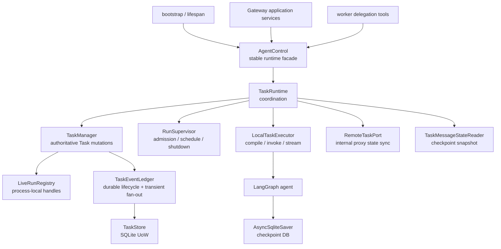

# Task execution runtime

本文说明 Ruyi Agent 的 runtime 如何把一个 Task 变成可执行、可观察、可恢复的
本地 Agent run。事实来源是当前实现和行为测试；总览见
[架构总览](../architecture.md)，启动与生命周期的 composition root 见
[`runtime/bootstrap.py`](../../src/ruyi_agent/runtime/bootstrap.py)。本文不把
Gateway 的传输协议或 channel 的投递语义重新定义为 runtime 契约。

## 负责范围

runtime execution plane 负责以下行为：

- 以 [`AgentControl`](../../src/ruyi_agent/runtime/delegation/async_runtime.py)
  作为稳定 runtime facade，装配并隔离任务执行组件；
- 创建、读取、恢复和变更 `TaskRecord`，协调一个 Task 的当前状态、当前
  `run_count`、结果/错误、pending review 和本地执行句柄；
- 对本地 Agent run 做 admission、排队、取消、完成和关闭；
- 把本地 Agent 的结果、LangGraph interrupt、安全的流式增量和 artifact manifest
  接到 Task 生命周期；
- 通过 TaskStore 的 Unit of Work 持久化 Task 与 durable lifecycle event；
- 从 LangGraph checkpoint 重建本地 Task 的 message snapshot，并提供稳定文本
  projection 所需的 runtime 原语；
- 对 runtime 内部的 `remote_ref` proxy 维护本地 Task 的状态、`run_count` 和
  未确定外部操作标记。这里仅说明这些标记如何影响 Task；远程传输和委派细节另有
  文档边界。

下文把“run”定义为一次被监督器接纳的执行代次。当前代码没有独立持久化的
`RunRecord`；Task 的 `state` 描述当前 run/Task 的状态，`run_count` 标识该代次。

## 不负责范围

以下行为不属于本文或 runtime execution facade 的所有权：

- Gateway route reservation/activation、command claim/replay、公开 remote route
  和 HTTP route；这些属于 `gateway/` 与 `channels/http/`；
- delegation 树、深度/数量预算和跨 Gateway delegation context；
- middleware 或 tool 的具体语义（包括工具调用、权限、审批策略的细节）；
- skills 的 catalog、解析、内容和 view 同步；
- mailbox、settled outbox 以及 child settlement 投递；
- A2A transport、远端 HTTP/SSE 协议和远端响应校验的完整语义；
- Telegram/Feishu/channel session、receipt、delivery 和外部消息发送。

这些组件可以调用 runtime 的稳定入口，或接收 runtime 的 Task 观察结果，但不会
因此取得 Task 状态机或 TaskStore 的所有权。

## 入口调用方

runtime 没有把 HTTP 作为内部入口。当前调用关系是：

1. `GatewayTaskModule`/`GatewayTaskService` 处理 Gateway application operation，
   再通过 [`AgentControl`](../../src/ruyi_agent/runtime/delegation/async_runtime.py)
   调用 `spawn_task`、`send_task_input`、`cancel_task`、review decision、Task
   lookup、本地事件 stream 和本地 message snapshot。Gateway 的 route/command
   选择、认证和 public response projection 仍由 Gateway 层拥有；见
   [`gateway/tasks.py`](../../src/ruyi_agent/gateway/tasks.py) 和
   [`gateway/task_service.py`](../../src/ruyi_agent/gateway/task_service.py)。
2. runtime 的 worker delegation tools 通过 `TaskCommandPort`/同一 facade 发起
   子 Task 或继续输入。具体 tool schema、delegation tree 和预算不在本文展开。
3. Gateway webhook/reconciliation 路径可以把远端状态事件交给
   `handle_remote_task_event`，把远端 Task 的已验证状态同步到本地 proxy。远端
   transport 本身不是 runtime 的公开 API。
4. [`bootstrap_application`](../../src/ruyi_agent/runtime/bootstrap.py) 负责创建
   `AgentControl`、提供 checkpointer/backend/stores，并在 lifespan 结束时调用
   `close`。channel adapter 通过 Gateway client 访问 Gateway，不直接取得
   `AgentControl`；这保持 channel 与 runtime 的边界。

## 组件关系



| 组件 | 所有权与职责 | 不替代什么 |
| --- | --- | --- |
| `AgentControl` | 组合 runtime 依赖并暴露稳定的 Task、run、review、事件、message、远端 proxy 与关闭入口；也转发 backend 文件操作 | 不拥有 Gateway route/command 或外部 wire DTO |
| `TaskRuntime` | 对外 façade 后的应用协调器；统一 mutation admission、本地调度、review resume、settled continuation、远端状态同步和 checkpoint reader | 不把 Task 状态规则分散给调用方 |
| `TaskManager` | TaskRecord 的唯一状态写入口；协调持久化、lifecycle event、pending review 和 live handle | 不执行 Agent，也不决定 delegation policy |
| `RunSupervisor` | 监督可运行的 local run、维护 operation/mutation permit、拒绝关闭后的新工作并完成 shutdown | 不保存可恢复的 Task 状态 |
| `LocalTaskExecutor` | 按已选 Agent 编译/调用一次 LangGraph run，读取 stream values/interrupts，过滤并发布安全 delta | 不决定 Task 最终状态或 run admission |
| `LiveRunRegistry` | 只保存当前进程的 `asyncio.Task` 和该 handle 的 cancel 标记 | 不序列化 `TaskRecord`，不跨重启恢复 |
| `TaskEventLedger` | 把 durable lifecycle event 与 TaskStore 提交绑定，并在提交后 fan-out；单独 best-effort fan-out assistant delta | 不让 transient delta 成为恢复来源 |
| `TaskMessageStateReader` | 用共享 checkpoint reader 读取精确或 latest snapshot | 不建立独立 transcript 数据库 |

`TaskManager` 与 `RunSupervisor` 都会暂存一个本地 run handle：前者通过
`LiveRunRegistry` 为状态判断和显式取消服务，后者的 `_runs` 为调度、完成回调和
关闭服务。两者都只是 process-local；它们不是两个不同的持久化 run 身份。

## 持久 Task 与进程内 run 的分离

[`TaskRecord`](../../src/ruyi_agent/task_models.py) 只包含可持久化、可恢复的字段：
`task_id`/Agent/thread 绑定、父/根关系、状态、结果/错误、`run_count`、远端绑定、
review/artifact projection，以及外部操作不确定性标记。它不包含 `asyncio.Task`、
`active_run` 或 `cancel_requested`；这由
[`test_task_model_boundaries.py`](../../tests/unit/test_task_model_boundaries.py) 约束。

进程内对象的边界如下：

| 层次 | 内容 | 崩溃/重启后的含义 |
| --- | --- | --- |
| durable | `TaskRecord`、TaskStore 的 pending review、Task lifecycle event | 可按 `task_id` 重新加载；状态以存储记录为准 |
| process-local | `LiveRunRegistry.LiveRun`、`RunSupervisor._runs`、permit、lock、编译 Agent cache | 不可恢复；必须释放或由恢复逻辑把孤儿执行标成 `interrupted` |
| LangGraph durable state | 独立 checkpoint DB 中的 graph state/messages | 由 `TaskMessageStateReader` 按 Task 的 thread 读取；不与 Task row 共用事务 |

若未配置 `TaskStore`（例如纯进程内测试），TaskManager 的 Task/review 只存在内存，
也不会建立 durable lifecycle event ledger；本地 event stream 会报告不可用，不能把
这种模式当作可跨重启恢复的运行时。

一个 handle 的完成不能代替 Task 状态提交；反之，Task row 已写入也不表示当前
进程仍有可取消的 handle。`TaskManager.has_active_run` 检查的是
`LiveRunRegistry`，不是 `TaskRecord.state` 的字符串推断。

## 主流程

一次 local Task 的 runtime 路径可以概括为：

1. Gateway application 或 worker delegation caller 通过 `AgentControl` 提交
   `spawn_task`；`TaskRuntime` 先完成 mutation admission，`TaskManager` 建立
   `pending` Task（`run_count=0`）。
2. `RunSupervisor.schedule` 在同一 admission 下创建被 release gate 挡住的
   process-local run handle；`TaskManager.mark_running` 原子写入 `running` 和
   `task.running`，递增 `run_count`，成功后才放行 payload。
3. `LocalTaskExecutor` 使用 Task 的 thread/run config 调 LangGraph Agent，读取
   values/interrupts，并把经过 provenance 过滤的 assistant delta 交给 transient
   stream；它返回的 graph output 仍由 `TaskRuntime` 解释。
4. `TaskRuntime` 按 output 选择 `waiting_for_human` 或 settled 状态，
   `TaskManager` 写入对应 Task row/lifecycle event；run handle 随后由 supervisor
   完成回调回收，尾部通知失败也不能改写已提交状态。

review decision 沿同一 Task 的 review identity 找到 owner，由 supervisor 调度带
`Command(resume=...)` 的下一代 run；settled Task input 则复用同一 `thread_id` 开启
下一代。两者都在 `mark_running` 时递增 `run_count`，并受同一 active-run 检查保护。
`remote_ref` Task 不在本进程启动 Agent，而是由 `RemoteTaskPort` 进行带 identity
的外部 operation，再把已验证结果或 uncertainty 同步为本地 proxy 状态。

## Task 状态、run_count 与生命周期

当前唯一状态词汇由 [`task_models.py`](../../src/ruyi_agent/task_models.py) 定义：

| 状态 | 分类 | 含义 |
| --- | --- | --- |
| `pending` | active | Task 已建档，当前代次尚未被调度执行；初始 `run_count` 为 0 |
| `running` | active/executing | 当前代次已经被 supervisor 接纳并占有本地 run handle，或 proxy 观察到远端运行 |
| `waiting_for_human` | active | 当前代次在一个 pending review 上等待决定，没有可继续的正常执行结果 |
| `completed` | settled/resumable | 当前代次成功结束，并可保留结果 |
| `failed` | settled/resumable | 当前代次因执行、输出或权威拒绝失败，并保留错误摘要 |
| `cancelled` | settled/resumable | 当前代次被显式取消 |
| `interrupted` | settled/resumable | 当前代次被被动取消、进程关闭/重启打断，或远端操作结果未确定而需刷新 |

`ACTIVE_TASK_STATES` 是 `pending`、`running`、`waiting_for_human`；
`SETTLED_TASK_STATES` 是 `completed`、`failed`、`cancelled`、`interrupted`。
当前实现把所有 settled 状态放入 `RESUMABLE_TASK_STATES`，但这表示“可在同一
Task 上开启下一代输入”，不是把旧 run 重新变成 running。

`run_count` 是 Task 内执行代次：

- `create_task_record` 先写入 `pending`/`run_count=0`，并提交 `task.created`；
- 每次 local `RunSupervisor.schedule` 在 payload 释放前调用 `mark_running`，使
  状态成为 `running` 并递增 `run_count`。首个 run 为 1；review resume 和 settled
  follow-up 继续使用同一个 `task_id`/`thread_id`，分别成为下一代；
- `TaskRecord`、lifecycle event、event cursor、assistant delta 和 artifact manifest
  都带有这一代的 `run_count`；固定代次的 stream 不会把后续代次混入；
- remote proxy 不自行猜测上游代次，而是接受已验证远端 payload 的非负
  `run_count`，状态同步时替换本地 proxy 的当前代次。

典型 local 状态变迁如下：

```text
create
  -> pending(run_count=0)
  -> running(run_count += 1)
      -> completed(result)
      -> failed(error)
      -> waiting_for_human(review)
           -> running(run_count += 1)  -- review decision / resume
      -> cancelled                       -- explicit cancel
      -> interrupted                     -- passive cancel / shutdown
settled (completed|failed|cancelled|interrupted)
  -> running(run_count += 1)             -- new Task input on same thread
```

单次 local Agent output 由 `normalize_agent_turn` 解释：恰好一个 review payload
进入 `waiting_for_human`；多个同时 review 或仍有未解析 tool call 进入 `failed`；
否则使用最后的 assistant 文本进入 `completed`。执行异常只在 Task 仍是 `running`
时转为 `failed`；已 settled 后发生的尾部异常不能倒写旧状态。

## Admission 与调度

所有会改变 Task 或可能启动外部工作的 runtime mutation 先通过
[`RunSupervisor`](../../src/ruyi_agent/runtime/delegation/run_supervisor.py)：

1. `acquire_mutation()` 要求调用发生在当前 `asyncio.Task` 中，并检查 runtime 仍在
   accepting；它发出只覆盖短临界区的 `_MutationPermit`。关闭已经开始时，调用
   失败为 `RuntimeClosingError`，不会为了得到一个更深层的 Task 错误而继续查找或
   执行 payload。
2. `spawn_task`、`send_task_input`、`submit_review_decision`、`cancel_task` 和远端
   event mutation 使用 mutation permit；不需要 await 的 remote-record 建档通过
   同一 supervisor 的 `mutate_now`。permit 绑定 supervisor、拥有它的
   `asyncio.Task` 和一次性 nonce，不能复制、跨协程转移或重复释放。
3. 需要等待协调锁或执行 external I/O 时，`promote_to_operation()` 原子地消费
   mutation permit，换成受跟踪的 `_OperationPermit`。这样短 mutation 不会被网络
   await 长时间占住，同时 shutdown 能找到并取消尚未返回的 operation。结束时必须
   清理 operation；清理本身具备 cancellation-safe 的 finally 语义。
4. `schedule()` 在 schedule lock 与 lifecycle condition 下再次验证 permit、关闭
   状态和同 Task 是否已经有未完成 run。已有 active handle 时抛
   `TaskAlreadyRunningError`，第二个 payload 不会执行。
5. supervisor 先创建一个由 release event 门控的 run task，再调用
   `TaskManager.mark_running` 写入状态/event，成功后才释放 payload。若 Task/event
   写入失败，会取消并回收该 run handle，并恢复 `mark_running` 调用前受保护的
   Task/review/live-handle 快照；首次 spawn 的快照才是 `pending` 与 `run_count=0`，
   settled follow-up 保留原 settled 状态，review resume 保留 `waiting_for_human` 及
   pending review，payload 不会被执行。

`TaskRuntime` 负责决定调用哪个 component，`RunSupervisor` 只负责 admission 与
生命周期安全，`TaskManager` 只负责状态写入。这个分工避免“Agent 已经开始但
`running` 尚未持久化”的 execution-before-save 间隙。

## Local execution、stream 与 durable event

### LocalTaskExecutor

`TaskRuntime` 按 Agent 名称从 `AgentRegistry` 取得 local spec，并用
`LocalTaskExecutor.compile_agent` 调用 `create_runtime_agent`。编译时注入共享的
backend、LangGraph checkpointer、TaskManager 的 thread hydration callback 和
其它由 bootstrap 解析好的依赖；编译后的 Agent 在当前进程按 Agent 名称缓存，
`TaskRuntime.close` 时清理。具体 middleware/tool 行为不在本文负责范围。

每次 run 由 `build_run_config` 生成 `configurable` 上下文，至少绑定
`thread_id`、`task_id`、父/根 Task、depth 和 Agent 名称。首次输入和同 Task 的
后续输入都传入同一个 Task 的 `thread_id`，因此 checkpoint 对应同一会话，而不是
为 follow-up 创建新的 Task 身份。

若 Agent 有 `astream`，executor 以 `stream_mode=["messages", "values"]`、
`version="v2"` 读取 stream：

- 只接收带公开 LangGraph provenance、来自 model 的 assistant message chunk，
  通过 `assistant_delta_from_stream_part` 过滤后交给 `TaskEventLedger`；
- 从 `values` 保存本次 graph 输出和 interrupts；若 stream 没有 values，则用
  `aget_state` 读取已提交 state；两者都不可用时该 run 失败；
- executor 返回 `GraphOutput`，由 `TaskRuntime` 再做 review/result/error 的
  Task 状态判定。

`assistant.delta` 是实时体验的 transient fan-out：没有 durable event id，不写入
Task event ledger，慢订阅者或断线可以丢失。它不能作为恢复、重放或判断 run 结束
的依据。Task 状态变化、review 和 artifact manifest 通过
`TaskManager`/`TaskEventLedger` 写成 durable lifecycle event；常见 event type 是
`task.created`、`task.running`、`task.review_requested`、`task.completed`、
`task.failed`、`task.cancelled`、`task.interrupted` 和
`task.artifact_published`。

### 固定 run 的事件观察

`open_local_task_event_stream` 只打开一个固定 `(task_id, run_count)` 的
`TaskEventSubscription`，不取得或取消 Agent run 的所有权。

- 新 stream 要求请求的 `run_count` 等于当前 Task，并首先给一个
  `task.snapshot`；如果当前代次尚无 event，ledger 在同一个 TaskStore 事务中补
  一个 reconciled anchor；
- 带 `last_event_id` 的恢复 stream 只按 opaque cursor 继续读 durable event，不
  重新插入 snapshot。cursor 同时绑定 Task 和 run，跨 Task/代次或格式错误会被
  拒绝；
- 订阅只从 SQLite 按 event id 顺序读取 durable backlog；后续代次出现时，旧代次
  在其 backlog 读完后以 `stream.end(reason="superseded")` 结束；当前代次在
  completed/failed/cancelled/interrupted/review 等 full-state event 后以相应
  reason 结束；
- `stream.end` 也是本地 stream 控制项，没有 durable event id。真正可恢复的是
  snapshot 与 lifecycle event。

## Pending review 的权威资源

review 的权威身份是 `PendingReviewRecord` 的 `review_id`，它绑定 owner
`task_id`、`root_task_id`、payload、时间和 ingest sequence。TaskManager 通过
`get_pending_review`/`list_pending_reviews` 解析权威集合；有 TaskStore 时集合在
`agent_task_pending_reviews` 表中持久化，没有 TaskStore 时仅存在当前进程内。

`TaskRecord.pending_review` 有两种投影用途：

- owner Task 上保存当前 review payload，便于 Task state 和 lifecycle projection
  一起读取；
- child review 可能在 root Task 上带 `source_task_id` 做兼容 mirror。root mirror
  不是 review ownership，review decision 必须按 `review_id` 解析实际 waiting
  child；多个 sibling review 也各自独立。

创建、替换或清除 review 时，`TaskManager` 的 review memory transaction 先保存
内存快照；[`TaskReviewUnitOfWork`](../../src/ruyi_agent/storage/task_review_uow.py)
再在一个 TaskStore 事务中更新 owner Task、pending review 行、root projection 和
相关 lifecycle events。任一 durable 写失败都会 rollback 并恢复内存投影，原 review
仍可重试。

review resume 会按 review identity 找到 Task，由 supervisor 调度
`Command(resume={"decisions": ...})` 的下一代 run；该调度的 `mark_running` 提交会
同时清理 pending review。默认调用返回已启动的 `running` Task；`wait=True` 才等待
该 run 的结果。远端 proxy review 只把远端已验证状态同步回本地 Task；远端决定如何
传输由其他边界负责。

## LangGraph checkpoint 与 message projection

bootstrap 为进程打开一个 `AsyncSqliteSaver`，把它同时交给本地 Agent 编译和
`TaskMessageStateReader`；checkpointer 的连接寿命由 bootstrap 管理，
`TaskRuntime` 不关闭或重新创建它。

`TaskRuntime.get_local_task_message_snapshot` 先验证 Task 是 local route，再以
Task 的 `thread_id` 调 reader：

- 指定 `checkpoint_id` 时精确读取该 checkpoint；不存在时报告
  `TaskMessageSnapshotNotFoundError`；
- 未指定时先读取 latest，取得 checkpoint id，再用该精确 config 重读一次。这样
  不会把 LangGraph 的 pending writes 混进 public snapshot；
- latest 没有 checkpoint 时返回明确的空 snapshot（`checkpoint_id=None`）；但已有
  checkpoint 的 state 无有效 `messages`，或 reader 失败时，报告
  `TaskMessageHistoryUnavailableError`，不把损坏/不可读的 state 伪造成空 transcript。

[`runtime/message_history.py`](../../src/ruyi_agent/runtime/message_history.py) 也
拥有稳定 projection 原语 `project_task_messages`：只把可识别的 user/assistant/tool
message 投影为文本、tool call、tool result status 和 sequence；没有底层 id 时按
Task 与内容 fingerprint 生成稳定 fallback id。Gateway 的分页/cursor 和 public
response 包装属于 Gateway，不在本文重新定义。当前 message reader/projection 的
checkpoint 精确读取、pending write 隔离和非法 payload 处理由
[`test_message_history.py`](../../tests/unit/test_message_history.py) 覆盖。

checkpoint 与 Task event 有不同的恢复职责：checkpoint 保存 graph state/messages；
TaskStore lifecycle event 保存 public Task 状态。一个 checkpoint 已写入，不等于
Task row/event 已在同一事务中提交，反之亦然。

## 取消、中断、settled continuation 与远端 proxy

### Local run

`cancel_task` 只对 active Task 有效。若找到当前本地 handle，
`LiveRunRegistry.request_cancel` 设置当前 handle 的 cancel 标记并调用
`asyncio.Task.cancel()`；run 的取消收尾检查该标记：

- 用户/调用方显式取消得到 `cancelled`，并清理 pending review；
- supervisor、事件循环或等待者导致的被动取消得到 `interrupted`，错误摘要保留
  `Task interrupted: ...`；
- 一个等待者自己被取消（例如 `wait=True` 的观察协程）不会取消 supervisor 所有
  的 run；它只停止等待，run 仍会继续，除非调用方另行 cancel Task；
- Task 已 settled 且没有活跃 handle 时，cancel 是 no-op，保留原 settled 状态。

所有 settled 状态都可以接收新的 Task input。runtime 在同一 `task_id` 和
`thread_id` 上开启新 run，递增 `run_count`，并在 `mark_running` 时清除上一次
运行的错误；旧 run 的 event stream 会被标成 superseded。`waiting_for_human` 不
通过普通 input 绕过 review；它必须走 review decision/resume。仍有 active local
run 时，直接调度第二个 run 会被 `TaskAlreadyRunningError` 拒绝；队列/mailbox
路径不属于本文。

### Runtime close

关闭与业务 cancel 不同：runtime shutdown 是 passive interruption。监督器在关闭
过程中把 accepting 置为 false，拒绝之后的新 mutation；已 admission 的
external operation 先被取消，等待短 mutation 清空，然后取消 maintenance/recovery
任务。已有 local run 在 `shutdown_grace_period` 内允许自然完成；超时后取消并
gather，仍是 running 的 Task 持久化为 `interrupted`。关闭完成后清空本地 run/permit
集合，重复调用 `close` 是安全的。

### Runtime-internal remote proxy

`RemoteTaskPort` 为 `remote_ref` Task 保存本地 proxy record。远端状态 payload 通过
Task identity、状态词汇和 `run_count` 验证后，才可更新本地 `TaskRecord`：

- 已知远端 settled/waiting/running 状态同步为本地对应状态，review 也进入本地
  pending review 集合；
- 发起 external operation 前先在 TaskStore 保存 operation/identity；进程取消、
  网络失败或响应无法证明 effect 时，本地 Task 变为 `interrupted` 并保留
  `external_operation`/identity，表示“需要 refresh/reconcile”，不把未知结果假
  装成 completed 或 failed；
- 后续 refresh 或已绑定的权威事件证明 effect 后，清理 uncertain marker，并按
  远端状态更新 Task。这里的说明只限定本地 Task 的影响；A2A transport、重试和
  远端 route contract 不属于本文。

## 恢复与关闭

### 启动后的恢复

`TaskManager` 不在构造时把所有 Task 都伪装成 live run。它支持按 Task id、按
parent thread 或列举 persisted records 懒加载；已存在且仍有 live handle 的记录不会
被存储副本覆盖。

恢复一个持久记录时，`task_record_for_restart` 应用如下规则：

- local `pending`/`running` 是原进程已失去 handle 的 executing state，恢复为
  `interrupted`，并保存“local process restarted”错误；在有事件 ledger 时同时写入
  `task.interrupted`，因此重启前后的状态变化可被观察；
- remote proxy 若保留 unresolved external operation，恢复为带 uncertain marker
  的 `interrupted`，要求 refresh/reconciliation；不凭空再发起一次可能重复的
  effect；
- settled Task 与 `waiting_for_human` 保持其状态和 durable review，可继续查询或
  按规则开启下一代。

`wake_pending_mailbox_tasks`/`start_mailbox_recovery` 是 bootstrap 交给 runtime 的
生命周期钩子，但 mailbox/settled outbox 的 claim、投递和恢复语义不在本文负责。
这里仅要求它们不能把失去的 process-local run handle 当成已恢复的 local execution。

### 资源关闭顺序

`TaskRuntime.close` 先等待 `RunSupervisor.close` 完成 admission 收口、run drain/
cancel 与 interruption 持久化，再清理 compiled Agent/cache、input lock 和
event ledger。bootstrap 外层随后按反向资源顺序关闭 review audit、mailbox、Task
store、command/route stores、checkpointer 和 backend；并在停止接收 HTTP traffic
后才离开 lifespan。具体顺序由
[`test_runtime_bootstrap_shutdown.py`](../../tests/unit/test_runtime_bootstrap_shutdown.py)
验证。

`RunSupervisor.close` 使用独立的内部 close task；即使 close 的调用者被取消，内部
cleanup 仍会完成，下一次 close 可等待同一结果。这保证 Task 被标记
`interrupted` 后，TaskStore、event ledger 和 checkpointer 不会过早关闭。

## Durable 一致性与事务边界

### TaskStore 内的原子性

[`TaskStore`](../../src/ruyi_agent/storage/task_store.py) 是 storage facade；
`TaskDatabase` 持有连接、锁和 commit/rollback，repository 写单一资源，UoW 组合
跨 repository 的同库写入。下列操作可以在同一个 TaskStore SQLite UoW 内原子提交：

- `insert_task_with_event`：新 Task row 与首个 lifecycle event；
- `update_task_with_event`：Task row 与对应 lifecycle event；启用 durable settlement
  时，settlement intent 也在同一个 SQLite UoW 插入，intent 插入失败会与 row/event
  一起 rollback；
- `update_review_transition`：owner Task、pending review、root compatibility
  projection 与事件；
- 事件 append 与其参与的 Task identity 检查。

因此 event append 失败时，Task row 不会单独留下新状态；review transition 失败时，
owner/root/review 也不会留下部分更新。`mark_running` 的 admission 写失败时，run
不会越过 schedule 的 release gate 执行。只有由 `_review_memory_transaction` 保护的
Task state/review/live-handle transition 才同时恢复进程内快照；通用 UoW（例如
`add_artifact`）不承诺这一内存回滚。TaskStore 的单元测试也直接证明了更新与 event
append 的 rollback，以及 review transition 的 rollback；见
[`test_task_store.py`](../../tests/unit/test_task_store.py)。

### 明确不是跨库事务

上述原子性只针对 TaskStore 自身的 SQLite 事务。当前实现没有跨数据库事务：

- `GatewayRouteStore` 的 route reservation/activation 与 TaskStore 的 Task row/event
  不在一个事务中；route 变化由 Gateway route workflow 和 reconciliation 处理，
  不应在本文宣称与 runtime Task 写入原子；
- `AsyncSqliteSaver` 的 LangGraph checkpoint DB 与 TaskStore 分离。Agent 调用中
  checkpoint 写入和 Task lifecycle event/row 没有跨库 two-phase commit；它们按各自
  的失败、恢复和 projection 边界处理；
- Gateway command claim、channel delivery 以及提交后的 outbox dispatch、mailbox
  delivery、wakeup 都在 TaskStore UoW 之外；启用 durable settlement 时，只有
  settlement intent 的插入属于上面的同库原子写入，后续投递是非权威尾部效果。

这一区分意味着：`Task row + lifecycle event` 可原子，不意味着 `route + Task +
checkpoint + 外部 side effect` 可原子。对可能已经发出的 remote effect，runtime
保存 identity/uncertainty，以 refresh/reconciliation 保留可查询性，而不是用事务
措辞掩盖不确定性。

## 错误边界与非权威 side effect

runtime 的错误先按是否影响 Task authority 分类：

| 失败位置 | Task 行为 |
| --- | --- |
| admission 关闭、permit 非法、同 Task 已运行 | 直接拒绝；不启动 payload，不改变已有 Task（除已经明确 admission 的清理） |
| Task row/event/review UoW 写入失败 | 对应 SQLite UoW rollback；仅由 `_review_memory_transaction` 保护的 Task state/review/live-handle transition 恢复进程内快照，通用 UoW（如 `add_artifact`）不承诺；`mark_running` 的 admission 写失败时，run payload 不越过 release gate |
| local Agent 执行异常且 Task 仍 `running` | 规范化异常摘要，提交 `failed` lifecycle event |
| 一个 run 被显式 cancel | 提交 `cancelled` lifecycle event |
| 一个 run 被被动取消或 runtime 重启/关闭 | 提交 `interrupted` lifecycle event；远端 unresolved operation 另保留 uncertain marker |
| checkpoint/message 重建失败 | 报 `TaskMessageHistoryUnavailableError` 或精确 checkpoint not found；不伪造 message |
| review audit、settled notification、webhook、transient fan-out 或 wakeup 失败 | 记录/日志该非权威失败，但不把已经提交的 Task state 反转 |

Task state/lifecycle event 一旦由 TaskManager 的权威写入口提交，后续 side effect
失败不能把 `completed` 改回 `running`/`failed`，也不能把 `cancelled` 改回 active。
例如 review resume 先持久化 review transition 并调度新 run，audit 失败只记录
“non-authoritative review audit failed”；测试
[`test_run_supervisor.py`](../../tests/unit/test_run_supervisor.py) 覆盖这一点。
已 settled 的 local run 在 webhook 等尾部逻辑中出现异常时，supervisor/runtime
也只记录尾部错误，不重新进入状态机。

remote external operation 的特殊点是：effect 是否发生本身尚未被证明，所以 runtime
会把本地 proxy 置为 `interrupted + uncertain`，而不是把一次网络异常当成可安全
重放或把未知状态当成权威失败。只有后续验证清楚，才清理 marker 并同步状态。

## 依赖与 ownership 方向

runtime 的稳定依赖方向可以压缩为：

```text
bootstrap
  -> AgentControl
      -> TaskRuntime
          -> TaskManager -> TaskStore / TaskEventLedger
          -> RunSupervisor / LiveRunRegistry
          -> LocalTaskExecutor -> create_runtime_agent -> LangGraph/checkpointer
          -> TaskMessageStateReader -> same checkpointer
          -> RemoteTaskPort -> remote integration boundary
```

- backend、checkpointer、TaskStore 和可选 review/mailbox 资源由 bootstrap 装配，
  runtime 使用但不拥有其进程级连接寿命；
- `AgentRegistry` 提供已解析的 Agent spec；`LocalTaskExecutor` 负责把 spec 变成
  Agent invocation，`TaskRuntime` 负责何时允许 invocation；
- `TaskStore` 只保存 Task、review、event 等 runtime durable record，不导入 channel
  或 transport 层；
- `TaskEventLedger` 的 durable event 使用 runtime-owned Task lifecycle projection，
  public HTTP/SSE 编码和 response projection 仍由 Gateway protocol/application
  层拥有；
- 具体 `RemoteTaskPort` 依赖只表达本地 proxy 的状态影响。委派 policy、A2A client、
  route ledger 和 public remote route 的 ownership 不向本 runtime 文档扩散。

## 测试证据索引

以下是当前仓库中与本文契约直接对应的行为证据（本文没有把它们当作本次编辑时
实际执行过的测试命令）：

| 关注点 | 证据 |
| --- | --- |
| Task/Run model separation、canonical states、LiveRunRegistry replacement/cancel | [`test_task_model_boundaries.py`](../../tests/unit/test_task_model_boundaries.py)、[`test_task_state_contracts.py`](../../tests/unit/test_task_state_contracts.py) |
| spawn → run → settled、same-thread follow-up、cancel/interrupted、restart 和 remote proxy refresh | [`test_async_subagent_task_runtime.py`](../../tests/unit/test_async_subagent_task_runtime.py) |
| local stream invocation、safe assistant delta、无 values 时读 state、stream failure、artifact 与 review resume | [`test_async_subagent_local_executor.py`](../../tests/unit/test_async_subagent_local_executor.py) |
| mutation/operation permit、并发 schedule、mark-running rollback、graceful/forced close、caller cancellation、side-effect failure | [`test_run_supervisor.py`](../../tests/unit/test_run_supervisor.py) |
| durable snapshot/lifecycle/delta/end、fixed-run cursor、replay/superseded、slow subscriber、restart event 和 race | [`test_task_events.py`](../../tests/unit/test_task_events.py) |
| TaskStore row/event rollback、review transition 原子性、duplicate identity 和存储边界 | [`test_task_store.py`](../../tests/unit/test_task_store.py)、[`test_task_storage_boundaries.py`](../../tests/unit/test_task_storage_boundaries.py) |
| pending review authoritative set、root mirror、sibling independence、restart rebuild 和 retry | [`test_async_subagent_task_manager_reviews.py`](../../tests/unit/test_async_subagent_task_manager_reviews.py) |
| exact checkpoint read、latest re-read、textual message projection 与非法 remote page | [`test_message_history.py`](../../tests/unit/test_message_history.py) |
| bootstrap 资源装配、runtime close 先于 stores/checkpointer/backend | [`test_runtime_bootstrap_shutdown.py`](../../tests/unit/test_runtime_bootstrap_shutdown.py)、[`test_app_runtime.py`](../../tests/unit/test_app_runtime.py) |

局部改动应优先运行与其契约相符的定向测试；跨 runtime/Gateway/storage 或 CI gate
需要时再执行仓库规定的更大范围验证。文档本身提交前至少检查链接目标和
`git diff --check`。

## 同步触发

下列代码或稳定行为变化应同步更新本文，并同时补充/调整对应测试证据链接：

- `AgentControl` 的稳定调用面、TaskRuntime 的 admission/调度/close/recovery
  契约改变；
- canonical Task states、`run_count`、cancel/interrupted/resume 规则、review
  authority 或 TaskRecord/live handle 边界改变；
- TaskStore 的 Task/event/review UoW 原子性、lifecycle event 类型、fixed-run
  stream 或 transient delta 规则改变；
- LangGraph checkpoint 注入、精确 snapshot 读取、message projection 的稳定字段
  或错误边界改变；
- local execution 在“Task 状态提交 → Agent payload → completion/side effect”
  顺序、远端 proxy uncertainty 对 Task 状态的影响或 runtime shutdown 顺序上改变。

以下变化只应更新其所属文档，除非同时改变了上面的 runtime contract：Gateway
route/command/public remote route、delegation tree/budget、middleware/tool 语义、
skills、mailbox/settled outbox、A2A transport，以及 channel delivery。实现和测试
是事实权威；若它们与本页文字冲突，应先修正文字或明确边界，再合入行为变化。
