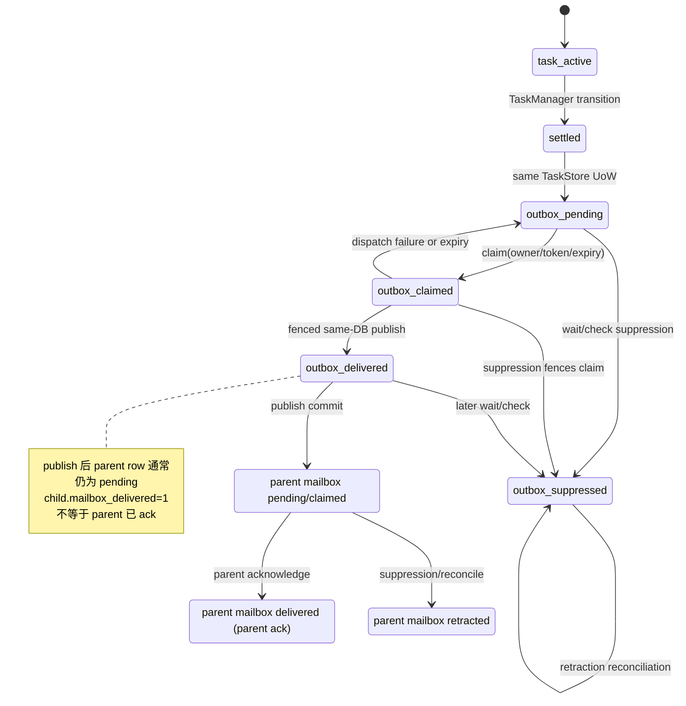

# Task Mailbox 与 child settlement

本文记录当前 runtime 中两条相互衔接、但持久化边界不同的流程：Task input
mailbox，以及 child Task run settled 后向 parent mailbox 的通知。事实来源是当前
代码和行为测试；跨层结构可参见[架构总览](../architecture.md)。本文不把
mailbox 当作通用事件总线，也不把一个 Task 的 settled run 当作 Task 会话的终结。

## 负责范围与边界

本系统负责：

- 为已有 Gateway Task 保存输入，按可选 idempotency key 去重，并在安全的 model
  boundary 注入；
- 为本地 Task 的 triggering input 做唤醒，使用 claim lease，并在 Agent 执行器
  成功返回后确认消费；
- 将 child Task 的 settled state、lifecycle event 和 settled outbox intent
  协调在同一个 TaskStore Unit of Work；
- 由 fenced outbox claim 把 intent 发布到 parent Task/thread 的 mailbox，维护
  `mailbox_delivered`，处理 wait/check 的抑制与撤回，并在启动和周期维护时重试、
  对账和唤醒 recipient。

下列行为明确不属于本文：

| 边界 | 所属组件或说明 |
| --- | --- |
| Channel inbound event receipt、Channel Turn receipt | Channel adapter 与其 session/receipt store |
| ChannelDeliveryStore、Telegram/Feishu 平台发送 | Channel presentation/delivery；外部发送结果不由 mailbox 证明 |
| external webhook 的请求、重试和认证 | remote/delegation integration 的尾部效果；settlement 不依赖 webhook 成功 |
| Task 通用状态机、run admission 和执行句柄 | `TaskManager`、`RunSupervisor` 与 Task runtime；本文只描述它们进入/消费 mailbox 的边界 |
| delegation scope、parent/child 可见性和预算 | `DelegationPolicy` 与 delegation tools；本文不扩大调用方权限 |
| 模型、工具、平台外部效果的 exactly-once | mailbox 只保证 durable identity、lease/fence 与可重试；模型调用和外部效果仍可能重复 |

### 入口调用方和依赖方向

`bootstrap_application` 创建 `TaskStore`、`MailboxStore` 和 `AgentControl`。Gateway
Task Module 通过 `AgentControl` 调用 `TaskRuntime.send_task_input`；runtime 内的
delegation tools 通过同一 command port 调用它。Channel adapter 只经
`GatewayHTTPClient` 访问 Gateway，不直接取得这些 stores。具体 composition 见
[`runtime/bootstrap.py`](../../src/ruyi_agent/runtime/bootstrap.py) 和
[`async_runtime.py`](../../src/ruyi_agent/runtime/delegation/async_runtime.py)。

Task input 的消费者是 `MailboxMiddleware`，它在每次 model call 前从当前
`task_id`/`thread_id` 读取；本地执行器在 graph invocation 返回后确认 claim。child
settlement 的协调者是 `TaskManager`、`SettledRunNotifier` 和
`SettledOutboxRepository`，分别拥有 Task 写入口、提交后的 dispatch/reconcile 尾部
和 outbox lease。

### Durable 存储前提

生产 bootstrap 用 settings 的同一个 `task_db` 构造 `TaskStore(task_db)` 和
`MailboxStore(task_db)`。当 `AgentControl` 同时收到 TaskStore 与 mailbox 时，
composition root 要求二者指向同一个 SQLite 数据库；不同文件、独立的
`:memory:` 连接或 in-memory AgentMailbox 的组合会被拒绝；若省略 mailbox，则
durable settlement 被关闭而不是被伪造成可投递。这里的“同库”是同一个 SQLite
文件/共享 URI，不是同一个 Python connection：两种 store 仍各自拥有连接和锁。

这个要求是 child settlement 的安全前提，因为 dispatch transaction 需要同时看见
`agent_tasks`、settled outbox 和 mailbox row；它不是把 TaskStore、MailboxStore
或 Channel store 合并成一个 ownership。没有 TaskStore 的纯进程内模式可以工作，
但不能宣称跨重启恢复；带 idempotency key 的 local input 需要持久 mailbox。若使用
非 durable compatibility mailbox，settled notifier 的 direct publish 也不具备下文
Task/event/intent 与 mailbox 的同库原子保证。

## 一眼看清的两条流程

```text
Task input:
caller -> publish_input/persistent row -> triggering wakeup
       -> claim(owner/lease) -> before_model injection
       -> graph invocation succeeds -> exact run-token acknowledgement

Child settlement:
child Task state + lifecycle event + outbox intent (one TaskStore UoW)
       -> claim/fence -> same-DB publish to parent mailbox
       -> outbox delivered + child mailbox_delivered=1
       -> best-effort recipient wakeup -> parent claims at its next model boundary
```

两条流程共享 recipient identity 和 SQLite 文件，但不要混淆：input claim 的确认
发生在消费它的 Agent invocation 后；settled outbox 的 delivered 表示通知已写入
parent mailbox，不表示 parent 已经调用模型或读到了通知。

## 流程一：Task input mailbox

### 输入发布与幂等

`TaskRuntime.send_task_input` 对 local Task 将输入交给
[`AgentMailbox.publish_input`](../../src/ruyi_agent/runtime/mailbox/service.py)，
保存 recipient Task/thread、content、可选 sender identity、`trigger_run` 和
`idempotency_key`。持久实现是 [`MailboxStore`](../../src/ruyi_agent/storage/mailbox_store.py)
的 `agent_mailbox_messages`；新行从 `pending` 开始。

- `idempotency_key` 是可选的。持久表对它施加唯一约束，重复发布会被忽略，因而
  网络/调用重试不会产生第二个逻辑 input row；`message_id` 也必须保持唯一。
- mailbox 自身只做 identity 去重，不做 request hash 冲突投影，也不证明 input
  对模型、工具或外部系统产生 exactly-once effect。Gateway command 的更高层
  idempotency/replay 仍属于 Gateway 边界。
- `send_task_input` 传入 idempotency key 时，如果 runtime 没有持久 mailbox，会
  返回 `DurableTaskMailboxRequiredError`，不伪造可跨崩溃兑现的保证。
- `trigger_run=True`（默认）表示 settled/resumable recipient 在没有 active
  handle 时需要被唤醒；`False` 的 input 仍可在下一次已有 run 的 model boundary
  被 claim，但不会单独触发 idle Task。

### Trigger 与 wakeup

发布提交后，runtime 先尝试 `_ensure_task_awake`：它只为 local、没有 active run、
处于 `RESUMABLE_TASK_STATES` 且存在 pending triggering input 的 Task 调度一个
空 payload run。这个空 payload 不是业务输入；真正的输入由 middleware 在 model
前读取。active run 不会被第二次调度，输入留在 mailbox，等待该 run 的下一个安全
model boundary。

run 结束时，`on_run_finished` 还会排一个受 supervisor 管理的 maintenance wakeup，
用于覆盖“输入到达时 Task 正在收尾”的窗口。wakeup 只是推进器：它失败、进程在
发布后退出或 parent 当时正在运行，都不改变 pending row；后续扫描仍以 SQLite
中的 row 为准。

### Claim lease 与 model 前注入

[`MailboxStore.claim`](../../src/ruyi_agent/storage/mailbox_store.py) 在 SQLite
transaction 中为精确 recipient 选择 pending rows，写入 owner、claim token 和
lease；过期 claim 可被释放，竞争的 store connection 只有一个能成功。每个
`LocalTaskExecutor` invocation 都有一个仅进程内存在的 run identity；
`MailboxMiddleware` 在该 run 的每个 model boundary 把新 claim batch 的 token
登记到这个精确 run。一个 run 可以在多次 model call 中得到多个 token batch。

Agent invocation 正常返回时只确认该 run 登记的、仍未过期的 owner+token batches；
异常、显式取消和 runtime 被动取消时只释放该 run 的相同 token batches。确认、释放和
续租都比较 owner、token 和未过期 lease：stale token、另一 replica 的 owner 或已过期
token 都不会改变 row。因而同一 owner 后续 run 取得的 claim 不会被前一 run 的尾部
批量确认；没有 `recipient_task_id` 的 legacy thread row 仍会被当前 run 正常 claim 并
按相同 fence 处理。

[`MailboxMiddleware`](../../src/ruyi_agent/runtime/middleware/mailbox.py) 的
`before_model`/`abefore_model` 从 LangGraph configurable context 取得当前
`task_id`、`thread_id` 和 executor 注入的 `mailbox_run_id`，执行 claim，并把结果渲染为一个带
`source=agent_mailbox` 和 message id 列表的 `HumanMessage`。普通 input 会保留
sender identity；child settlement row 会以独立的 settled-notification 文本呈现。
claim 只代表暂时占有，不能单独算作已消费。

状态图（只画本 mailbox 的 durable 边界）：

```mermaid
stateDiagram-v2
    [*] --> pending: publish_input commit
    pending --> claimed: before_model claim
    claimed --> delivered: invocation returns; exact run tokens ack
    claimed --> pending: run error / explicit or passive cancel; exact tokens release
    claimed --> pending: process disappears/restarts; old lease expires
    pending --> claimed: retry or wake at next boundary
    note right of pending
      trigger_run=1 才会唤醒 idle Task
      duplicate idempotency key 不新增 row
    end note
    note right of claimed
      一个 run 可有多个 token batch
      stale/expired token 不会确认、释放或续租
    end note
```



### Ack、失败与恢复

`LocalTaskExecutor.execute` 只有在 Agent graph invocation 正常返回后才确认该
invocation 的 token batches；调用异常或被取消时会先释放同一批 token。这样同一进程
可以马上在下一次 run reclaim 并再次注入；进程在 claim 后崩溃时，run identity 不会
持久化，仍由旧 lease 到期后的新 owner reclaim。runtime 的 Task failed/interrupted
写入和 mailbox ack/release 不是同一个跨对象事务：即使确认已提交，之后的 Task outcome
normalization 或 lifecycle 写入仍可能失败，反之亦然；若确认本身失败，执行器只会尝试
释放相同 token，最终仍可由 lease 恢复。

## 流程二：child settlement 到 parent mailbox

### Settlement 资格与 intent identity

local run 在 `TaskRuntime` 中经 `TaskManager.mark_completed`、`mark_failed`、
`mark_cancelled` 或 `mark_interrupted` 进入本轮 settled；经过验证的 remote
payload 同样可同步为 settled。`waiting_for_human`、`pending` 和 `running` 不会
产生本轮 settled intent。

[`build_settled_outbox_intent`](../../src/ruyi_agent/storage/settled_outbox.py)
只为同时满足以下条件的当前 `(task_id, run_count)` 建立 intent：Task 是 settled，
有 `parent_thread_id`，没有 `mailbox_suppressed`/`mailbox_delivered`，且没有未解决
的 external operation 或 uncertain marker。identity 是确定的
`settled:<parent_thread_id>:<task_id>:<run_count>`，并由它派生稳定 message id；
content 取本轮 result、error 或状态摘要。新的 Task run 会递增 `run_count` 并得到
独立 identity，旧 run 的 delivery/suppression 不会覆盖新 run。

### TaskStore UoW：state、event、intent

启用 durable settlement 时，TaskManager 的 lifecycle 写入口经
[`TaskEventLedger`](../../src/ruyi_agent/runtime/task_event_ledger.py) 调用
[`TaskStore.update_task_with_event`](../../src/ruyi_agent/storage/task_store.py)。
`TaskLifecycleUnitOfWork` 在同一个 TaskStore SQLite transaction 中更新 Task row、
追加 public lifecycle event，并插入 settled outbox intent；review transition
路径也会把适用的 Task/event/outbox 写入同一个 UoW。任一项失败，Task state、event
和 intent 一起 rollback，进程内受保护的 Task snapshot 也恢复。

这条原子边界不延伸到 LangGraph checkpoint、Gateway route/command、MailboxStore
的后续 dispatch、recipient wakeup 或 webhook。Task/event/intent 的提交是权威
事实；`TaskEventLedger` 的 subscriber fan-out 和 notifier 的尾部动作都发生在
commit 之后。



### Claim、fence、publish 与 delivered flag

[`SettledOutboxRepository.claim_pending`](../../src/ruyi_agent/storage/settled_outbox.py)
在 TaskStore 数据库中释放过期 lease，并为仍有效、未 suppressed/delivered 的
pending intent 写入 owner/token/expiry；带 unresolved remote effect 的 settlement
不会进入本次 dispatch。

`SettledRunNotifier` 随后把 claim 交给
[`MailboxStore.publish_claimed_settled_outbox`](../../src/ruyi_agent/storage/mailbox_store.py)。
该方法在同一个 SQLite 文件上核验 outbox key、`status=claimed`、claim token 和
child run 的 suppression/uncertain 状态。核验通过后，按 deterministic identity
写入或复用 parent mailbox row，同时把 outbox 设为 `delivered`、清空 lease，并写入
child 的 `mailbox_delivered=1`；这些写入彼此原子。token 过期、被 fence 或已先提交
suppression 时返回 false，不产生新的 authoritative delivery。新建 parent row 从
`pending` 开始，child 的 `mailbox_delivered=1` 只是已写入 mailbox 的镜像，不是
parent 已读或已 ack。

publish transaction 成功后，notifier 镜像 `mailbox_delivered` 并推进 recipient
wakeup；parent 有 active run 时不另起并发 run，后续 model boundary 才 claim。没有
recipient Task identity 的 thread-only row 仍可被 parent thread claim，但没有定向
Task wakeup。

### wait/check 的 suppression 与 retraction

`wait_agent` 在等待/刷新前就抑制当前 child run 的 mailbox delivery；`check_agent`
在看到 settled run 后抑制。调用方既然已同步取得该结果，就不应再收到同一 run 的
异步通知。

`TaskStore.suppress_settled_delivery` 在同一 TaskStore SQLite transaction 中：

- 持久化 Task 的 `mailbox_suppressed=1`；
- 把对应 outbox 的 pending/claimed（以及已跨越 mailbox 边界的 delivered）标为
  suppressed，并清除 claim；
- 将同一 child/run 的 mailbox row 中仍为 pending/claimed 的记录标为 retracted，
  并记录 outbox 的 retraction watermark。

后续 dispatch 会因 Task/outbox suppression 检查失败而被 fence。即使 publish transaction
已经提交，只要 parent row 尚未被 parent ack、仍为 pending/claimed，后续 suppression
仍可把 outbox 改为 suppressed 并将该 row retract。已经是 parent acked `delivered`
的 mailbox row 不会被伪造为未发送；它保持 delivered，而 suppressed outbox 的
retraction reconciliation 只确认这项抑制已经收尾。`SettledRunNotifier.reconcile`
和 `MailboxStore.retract_settled_outbox` 负责补齐尚未撤回的 pending/claimed rows；
旧的非 outbox 兼容 row 也由 `mailbox.retract` 按 parent thread、child task 和
run_count 处理。

### 启动、周期对账与 recipient wakeup

bootstrap 在 Gateway readiness 打开前先推进 pending settlement、过期 claim、
suppression retraction 和 recipient wakeup；随后由 supervisor 管理维护循环，继续
dispatch/reconcile outbox、先释放过期 lease，再从活跃 executor run 的 snapshot 续租
仍未过期的 owner+token batches，并唤醒 pending recipient。maintenance 不会按 owner
盲续租：已结束的 run、未知 token 或已过期 token 都不续租，也不会把过期 claim
复活；即使续租本身失败，先前的 expiry recovery 仍已生效。dispatch、reconcile
和 wakeup 是提交后的非权威 tail：它们失败或进程退出时，已提交的 Task/event/intent
与 parent mailbox row 仍按 SQLite 状态保留，由后续 startup 或 maintenance 再推进；
wakeup 成功也不能替代 parent 真正 claim 和模型 ack。

## 事务边界与故障窗口

| 窗口 | 权威结果与恢复动作 |
| --- | --- |
| Task settled UoW 中 event 或 intent 写失败 | Task row、lifecycle event、intent 一起 rollback；不会留下一个可 dispatch 的 settled intent |
| outbox 已 claim，dispatch 前进程失败 | claim 到期后回到 pending；新的 owner 取得不同 token。显式 release 失败也不改变这一恢复路径 |
| mailbox publish 写入失败 | same-DB transaction rollback，outbox 仍是 claimed；notifier 尝试 release，之后由 lease/reconcile 重试 |
| publish transaction 已提交但 wakeup 未运行 | mailbox row、outbox delivered 和 child `mailbox_delivered=1` 已存在；新 row 通常仍 pending，pending trigger 扫描会再次推进 recipient。parent ack 前的 pending/claimed row 仍可被 suppression retract |
| parent claim 后模型调用失败或取消 | 当前进程只释放该 run 的 owner+token batches，下一次 run 可以立即 reclaim；其余 claim 不受影响。进程崩溃则由 lease 到期后的新 owner reclaim |
| wait/check 与 dispatch 竞争 | suppression 先提交时 stale publish 返回 false；publish 先提交时，后续 suppression 仍可把 outbox 改为 suppressed 并 retract 尚未 parent-acked 的 pending/claimed row；只有已 parent-acked 的 delivered row 保持 delivered |
| remote external operation 未证明 effect | 本地保留 operation identity 与 uncertain marker，不创建/发布新的 authoritative settlement；只有 refresh/权威 payload 证明 effect 后才清除 marker、同步状态并生成相应 intent |

其中 TaskStore 与 MailboxStore 的“同库”只使上表的 same-DB publish/suppression
transaction 成立；它不使 checkpoint、route、外部 webhook、模型调用或平台发送
加入 two-phase commit。

## 恢复、关闭与安全

### 恢复与关闭

Task mailbox 的可恢复对象是 SQLite row、claim expiry、outbox status 和
`run_count`；`LiveRunRegistry`/supervisor 中的 asyncio handle 是 process-local，
不能因为 mailbox wakeup 就当作已恢复。local executing Task 在重启/关闭时按 runtime
规则收尾为 interrupted；settled Task 可在同一 Task/thread 开启下一代 input。

FastAPI lifespan 先把 readiness 置为 false，再调用 `AgentControl.close()`。close
先停止 recovery/maintenance，等待关闭宽限期、取消仍在运行的 handles 并持久化
interruption，之后才按 bootstrap 的反向创建顺序关闭 `MailboxStore`、`TaskStore`
等 stores。这样不会在 claim recovery、outbox dispatch 或 Task interruption 仍可能
访问数据库时提前关闭连接；完整启动/关闭顺序见
[`runtime-configuration-and-bootstrap.md`](runtime-configuration-and-bootstrap.md)。

### 安全约束

- input claim 的 owner、token、expiry 和 recipient Task/thread matching 一起形成
  fence；input ack/release/renew 都比较 owner+token+未过期 lease，且 token 绑定到一个
  活跃的 in-process run。settled outbox 继续以它自己的 claim token 和 deterministic
  identity 防止过期 worker 覆盖新 owner。
- mailbox content 会被作为 model input 注入，应按不可信的跨 agent/user 内容处理；
  sender 字段是上下文身份，不是 authorization grant。调用方能否访问 parent/child
  由 delegation/Gateway 边界另行校验。
- 共享 Task DB 是一个信任边界；不要把不相关 runtime 或含凭据的数据库文件交给
  mailbox。secret 不应进入 mailbox content、Task result、日志或 public projection。
- remote upstream identity、状态和 run_count 必须先经 remote reconciliation
  验证；uncertain operation 不得先投影成 completed/failed settlement，也不得依
  普通网络重试猜测外部 effect。

## 测试证据

以下行为证据按 mailbox ownership 汇总：

- input publish、claim、model-boundary 注入、run-token acknowledgement/release 与
  lease fence：[`test_mailbox.py`](../../tests/unit/test_mailbox.py)、
  [`test_run_supervisor.py`](../../tests/unit/test_run_supervisor.py)。
- settlement intent、Task/event UoW、dispatch、wakeup 与 suppression/retraction：
  [`test_settled_outbox.py`](../../tests/unit/test_settled_outbox.py)。
- lease、restart recovery 与 claim/suppression race：
  [`test_settled_outbox_recovery.py`](../../tests/unit/test_settled_outbox_recovery.py)。
- remote uncertain effect 的 settlement qualification：
  [`test_remote_operation_reconciliation.py`](../../tests/unit/test_remote_operation_reconciliation.py)。
- bootstrap recovery、readiness 与关闭时序：
  [`test_runtime_bootstrap_shutdown.py`](../../tests/unit/test_runtime_bootstrap_shutdown.py)。

## 文档同步触发

以下变化应同步更新本文：

- mailbox、settled outbox、recipient wakeup 与相邻组件的 ownership 边界改变；
- input/settlement 的稳定输入输出改变，包括 idempotency、recipient identity、
  claim/delivered/suppression 状态或 model-boundary 注入；
- Task/event/intent 与 mailbox 的事务边界、lease/fence、失败恢复、重启/owner change
  或关闭语义改变；
- mailbox content、remote identity、uncertain effect 或其他 trust/security boundary
  改变。

只改变其他子系统的内部实现时更新其所属文档；跨越上述边界时再同步受影响的文档。
